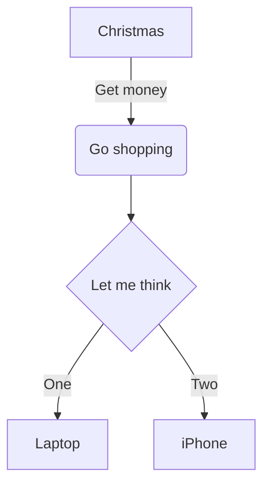
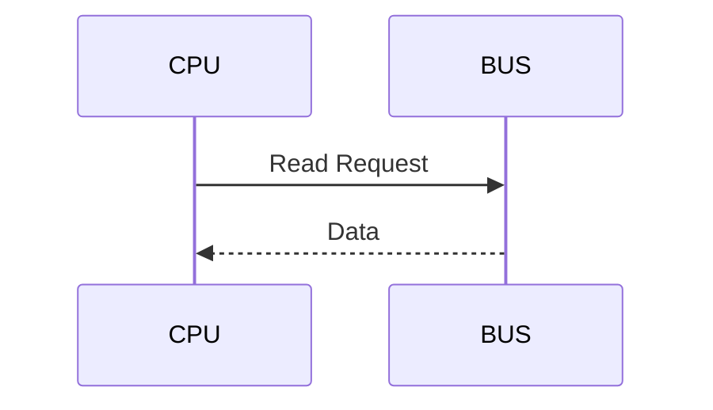
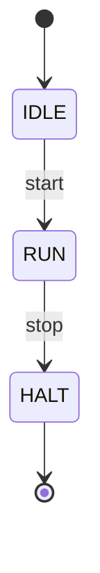

# Diagram Interpretation Reference

Comprehensive guide for extracting information from technical diagrams in documentation.

## Table of Contents

1. [Block Diagrams](#block-diagrams) - Component structure and connectivity
2. [Sequence Diagrams](#sequence-diagrams) - Temporal behavior and messages
3. [State Machine Diagrams](#state-machine-diagrams) - Control flow
4. [Timing Diagrams](#timing-diagrams) - Cycle-accurate signals
5. [Flowcharts](#flowcharts) - Algorithmic logic
6. [Architecture Diagrams](#architecture-diagrams) - System hierarchy
7. [Data Flow Diagrams](#data-flow-diagrams) - Information movement
8. [Mermaid/PlantUML Syntax](#mermaidplantuml-syntax) - Reading diagram code

---

## Block Diagrams

**Purpose**: Show component structure, hierarchy, and connectivity

**What to extract**:
- Component inventory (what modules exist)
- Hierarchical relationships (parent-child, instantiation)
- Interface connections (signals, buses, ports)
- Data flow direction (arrows indicate flow)
- Component boundaries (boxes, groups)

**Reading strategy**:
```
┌─────────────────┐
│   CPU Core      │
│  ┌──────────┐   │  ───▶ Instruction Bus
│  │ IF Stage │───┼──────▶ Data Bus
│  └──────────┘   │
│  ┌──────────┐   │
│  │ ID Stage │   │
│  └──────────┘   │
└─────────────────┘
```

Extract:
- CPU Core contains IF Stage and ID Stage (hierarchy)
- IF Stage connects to external buses (interfaces)
- Two buses: Instruction Bus and Data Bus (connectivity)
- Flow is outward from IF Stage (data direction)

**Common notation**:
- Boxes = Components/modules
- Arrows = Signal flow, data movement
- Dotted lines = Control signals or optional connections
- Thick lines = Buses (multi-bit signals)
- Double arrows = Bidirectional communication

---

## Sequence Diagrams

**Purpose**: Show temporal behavior and message exchange between entities

**What to extract**:
- Actors/participants (who is involved)
- Message sequence (order of operations)
- Timing relationships (what happens when)
- Conditional flows (alt/opt blocks)
- Return values (dotted arrows often indicate responses)

**Reading strategy**:
```
Master           Slave           Memory
  │               │                │
  │──Write Req──▶ │                │
  │               │──Read Addr───▶ │
  │               │◀──Data─────────│
  │               │──Process       │
  │◀───Ack───────│                 │
```

Extract:
- Three participants: Master, Slave, Memory
- Sequence: Master writes → Slave reads from Memory → Slave processes → Slave acknowledges
- Timing: Read happens before Process, Process before Ack
- Master waits for Ack (synchronous communication)

**Common notation**:
- Solid arrows = Requests/commands
- Dotted arrows = Responses/returns
- Boxes on timeline = Active processing
- Numbers = Step sequence
- `alt`/`opt` blocks = Conditional execution

---

## State Machine Diagrams

**Purpose**: Show control flow and state transitions

**What to extract**:
- State inventory (all possible states)
- Transitions (how states change)
- Trigger conditions (what causes transitions)
- Actions (what happens in states or on transitions)
- Initial/final states (start/end points)

**Reading strategy**:
```
        ┌──────┐  start
   ┌───▶│ IDLE │◀─────────
   │    └──────┘
   │       │ cpu_run=1
   │       ▼
   │    ┌──────┐  cpu_halt=1
   │    │  RUN │─────────┐
   │    └──────┘         │
   │       │             ▼
   │       │ error    ┌──────┐
   └───────┴─────────│ HALT │
                     └──────┘
```

Extract:
- Three states: IDLE, RUN, HALT
- Initial state: IDLE (marked or implied)
- Transitions:
  - IDLE → RUN when cpu_run=1
  - RUN → HALT when cpu_halt=1
  - RUN → IDLE when error
  - HALT → IDLE (reset path)
- Self-loops indicate staying in state

**Common notation**:
- Circles/boxes = States
- Arrows = Transitions
- Labels on arrows = Conditions/triggers
- Actions: `state / action` or `transition [condition] / action`
- Thick circle border = Initial state
- Double circle = Final state

---

## Timing Diagrams

**Purpose**: Show cycle-accurate signal behavior over time

**What to extract**:
- Signal transitions (rising/falling edges)
- Timing relationships (setup/hold, synchronization)
- Clock domains (which clock drives what)
- Valid windows (when data is stable)
- Protocol timing (handshake sequences)

**Reading strategy**:
```
clk     ┐   ┌───┐   ┌───┐   ┌───┐   ┌
        └───┘   └───┘   └───┘   └───┘

valid   ────┐           ┌───────────
            └───────────┘

data    ════X<══DATA══>X═══════════
              stable
```

Extract:
- Clock period (time between edges)
- `valid` asserts at rising edge, holds for 2 cycles
- `data` becomes stable when `valid` goes high
- `data` stable window: cycle 1-2
- Protocol: data must be stable when valid=1

**Common notation**:
- Square waves = Digital signals (clk, valid, ready)
- X-transitions = Data changes (don't care → stable → don't care)
- Shaded regions = Don't care or invalid
- Arrows = Causal relationships
- Time markers = Absolute or relative time
- Crossing signals = Multiple bits changing

---

## Flowcharts

**Purpose**: Show algorithmic logic and decision flow

**What to extract**:
- Process steps (operations performed)
- Decision points (conditionals)
- Branches (alternative paths)
- Loops (iteration)
- Entry/exit points

**Reading strategy**:
```
     ┌───────┐
     │ Start │
     └───┬───┘
         ▼
    ┌─────────┐
    │ Read PC │
    └────┬────┘
         ▼
    ◇─────────◇  Yes   ┌──────────┐
    │ Valid?  │───────▶│  Decode  │
    ◇─────────◇        └────┬─────┘
         │No                │
         ▼                  ▼
    ┌─────────┐        ┌──────┐
    │  Stall  │        │ Done │
    └────┬────┘        └──────┘
         │
         └──────▶ Back to Read PC
```

Extract:
- Algorithm starts with PC read
- Decision: Check if valid
- Two paths: 
  - Valid → Decode → Done
  - Invalid → Stall → Loop back to Read PC
- Loop condition: Keep stalling until valid

**Common notation**:
- Rectangles = Process/action
- Diamonds = Decision/conditional
- Circles = Connectors/join points
- Arrows = Flow direction
- Parallel paths = Concurrent operations

---

## Architecture Diagrams

**Purpose**: Show system-level hierarchy and layering

**What to extract**:
- System layers (abstraction levels)
- Component grouping (subsystems)
- Dependencies (what uses what)
- External interfaces (system boundaries)
- Scaling/replication (multiple instances)

**Reading strategy**:
```
┌─────────────────────────────┐
│     Application Layer       │
├─────────────────────────────┤
│   ┌──────┐    ┌──────┐     │
│   │ UVM  │    │Tests │     │  Verification
│   │ Env  │    └──────┘     │
│   └──┬───┘                 │
├──────┼─────────────────────┤
│      ▼                      │
│  ┌────────────────┐        │
│  │  RTL Design    │        │  Implementation
│  │  (DUT)         │        │
│  └────────────────┘        │
└─────────────────────────────┘
```

Extract:
- Two layers: Verification (top) and Implementation (bottom)
- Verification contains UVM Env and Tests
- Tests operate through UVM Env (not directly on DUT)
- Clear boundary between testbench and design

**Common notation**:
- Nested boxes = Hierarchy/containment
- Horizontal lines = Layer boundaries
- Vertical arrangement = Abstraction levels (top = high, bottom = low)
- Dashed boxes = Logical grouping (not physical modules)

---

## Data Flow Diagrams

**Purpose**: Show how information moves through a system

**What to extract**:
- Data sources (where data originates)
- Transformations (how data changes)
- Data stores (where data persists)
- Data sinks (where data terminates)
- Flow paths (routes data takes)

**Reading strategy**:
```
[UART Rx] ──▶ (Parse) ──▶ [FIFO] ──▶ (Decode) ──▶ [Register]
                │                        │
                ▼                        ▼
             [Error]                  [ALU]
```

Extract:
- Source: UART Rx (external input)
- Transformations: Parse, Decode
- Stores: FIFO, Register
- Sinks: Error log, ALU input
- Two output paths from Parse (data + error)
- Sequential flow: Rx → Parse → FIFO → Decode → Register/ALU

**Common notation**:
- Circles = Processes/transformations
- Rectangles = External entities
- Open rectangles = Data stores
- Arrows = Data movement
- Labeled arrows = Data type/name

---

## Mermaid/PlantUML Syntax

Many modern docs use Mermaid or PlantUML for diagram-as-code.

### Mermaid Block Diagram


**Reading**:
- `graph TD` = top-down graph
- `A[text]` = rectangular node
- `B(text)` = rounded node
- `C{text}` = diamond (decision)
- `-->` = arrow
- `|text|` = arrow label

### Mermaid Sequence Diagram


**Reading**:
- `participant` = actor
- `->>` = solid arrow (request)
- `-->>` = dotted arrow (response)

### Mermaid State Diagram


**Reading**:
- `[*]` = initial/final state
- `-->` = transition
- `: text` = condition

### PlantUML Timing Diagram
```
@startuml
clock   clk with period 10
binary "reset" as rst
binary "valid" as val

@0
rst is high
val is low

@20
rst is low

@30
val is high
@enduml
```

**Reading**:
- `@timestamp` = time markers
- `is high/low` = signal values
- `with period` = clock frequency

---

## Interpretation Best Practices

### Extract Key Information

For any diagram type, always identify:

1. **Entities**: What components/actors/states are shown?
2. **Relationships**: How do entities connect or interact?
3. **Flow**: What is the direction of data/control/time?
4. **Conditions**: What triggers changes or decisions?
5. **Timing**: When do things happen (sequence, duration)?

### Cross-Reference with Text

Diagrams complement written docs:

- **Diagram shows structure** → Text explains rationale
- **Diagram shows flow** → Text explains algorithm details
- **Diagram shows timing** → Text explains constraints
- **Diagram shows states** → Text explains state invariants

Always look for corresponding text that expands on diagram concepts.

### Handle Missing Diagrams

When diagrams would help but don't exist:

1. **Block diagram missing**: Infer structure from module instantiations in code
2. **Sequence diagram missing**: Infer from test sequences or protocol specs
3. **State machine missing**: Look for `case` statements or FSM variables in code
4. **Timing diagram missing**: Infer from assertion properties or comments

### Note Diagram Limitations

Diagrams simplify reality:

- May show idealized behavior (ignore corner cases)
- May omit error paths for clarity
- May use abstracted names (not exact signal names)
- May be outdated (check against code)

Always cross-validate diagrams with implementation.

---

## Common Diagram Pitfalls

❌ **Treating diagrams as complete documentation**: They're summaries
✅ **Use diagrams as navigation**: Point to where to read code/text

❌ **Assuming exact signal names**: Diagrams often use logical names
✅ **Map diagram names to code names**: Cross-reference with definitions

❌ **Ignoring diagram legends**: Miss notation meaning
✅ **Read legends first**: Understand symbols before interpreting

❌ **Missing temporal flow**: Misunderstand sequence
✅ **Follow time axis**: Top-to-bottom, left-to-right, or explicit time

❌ **Overlooking annotations**: Critical info in labels/notes
✅ **Read all text**: Labels, conditions, notes contain key details

---

## Summary

Diagrams provide visual documentation that complements text:

- **Block diagrams** → Component structure
- **Sequence diagrams** → Temporal behavior
- **State machines** → Control flow
- **Timing diagrams** → Cycle-accurate signals
- **Flowcharts** → Algorithmic logic
- **Architecture diagrams** → System hierarchy
- **Data flow diagrams** → Information movement

Key practices:
1. Identify diagram type to know what information it conveys
2. Extract entities, relationships, flow, conditions, timing
3. Cross-reference with text documentation and code
4. Validate diagram against actual implementation
5. Note limitations and potential inaccuracies

Diagrams accelerate understanding but must be validated against authoritative sources (specs, code, tests).
