# RV32I Control Flow Diagrams

**Document Type:** Control Flow Specification  
**Version:** 1.0  
**Date:** January 4, 2026  
**Status:** Design Phase - Pre-Implementation

---

## Table of Contents

1. [Overview](#overview)
2. [Hazard Detection State Machine](#hazard-detection-state-machine)
3. [Forwarding Priority Selection](#forwarding-priority-selection)
4. [Stall/Flush Propagation](#stallflush-propagation)
5. [Branch/Jump Control Flow](#branchjump-control-flow)
6. [Exception Trap Sequence](#exception-trap-sequence)
7. [MRET Return Sequence](#mret-return-sequence)
8. [Memory Arbitration State Machine](#memory-arbitration-state-machine)
9. [References](#references)

---

## Overview

This document provides Mermaid state machine and flowchart diagrams for key control logic components in the RV32I modular processor. These diagrams complement the module specifications by visualizing complex decision trees and state transitions.

### Document Purpose

- **Design Review:** Visualize control flow for architectural validation
- **Implementation Reference:** Guide RTL coding with clear decision logic
- **Verification Planning:** Identify state coverage requirements
- **Debugging Aid:** Trace control flow during simulation analysis

---

## Hazard Detection State Machine

### 2.1 RAW Hazard Detection Flow

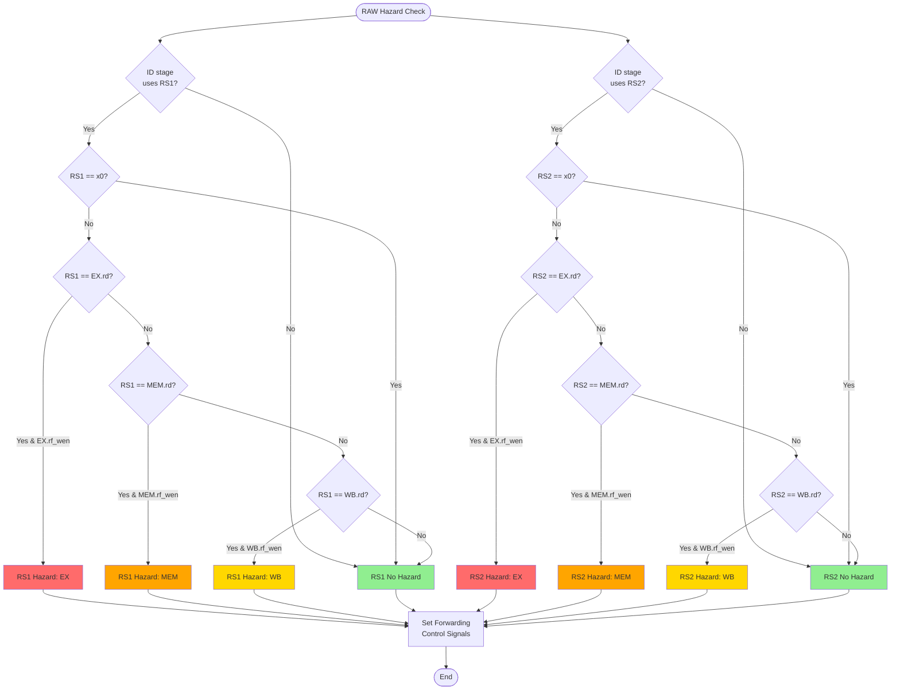

---

### 2.2 Load-Use Hazard Detection

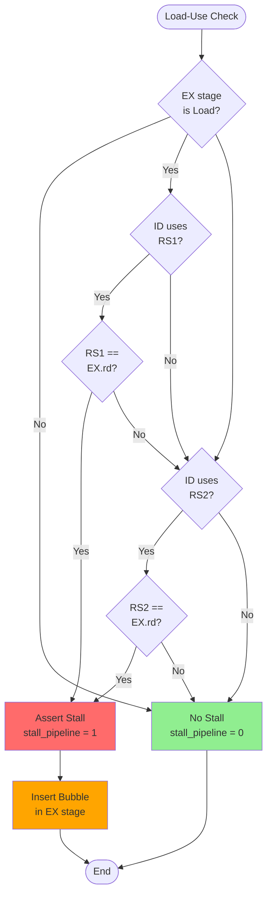

---

## Forwarding Priority Selection

### 3.1 RS1 Forwarding Multiplexer Control


**Priority Encoding:**
```
EX > MEM > WB > ID (highest to lowest priority)
```

**Rationale:** Newer data (closer to EX) takes precedence over older data.

---

### 3.2 RS2 Forwarding Multiplexer Control

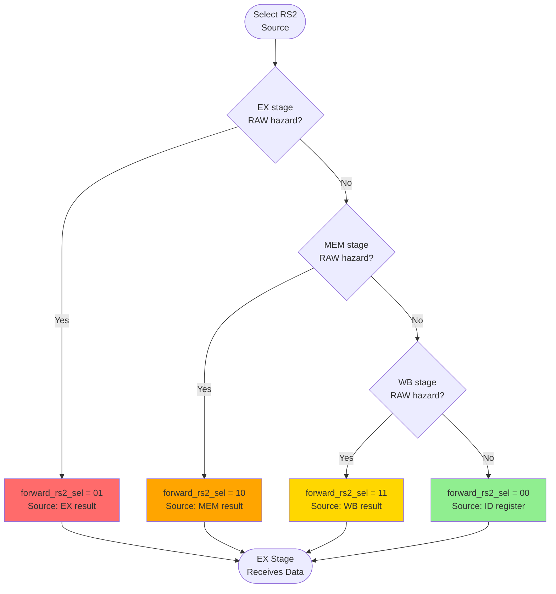

**Note:** RS2 forwarding logic is identical to RS1 (independent parallel paths).

---

## Stall/Flush Propagation

### 4.1 Pipeline Control State Machine

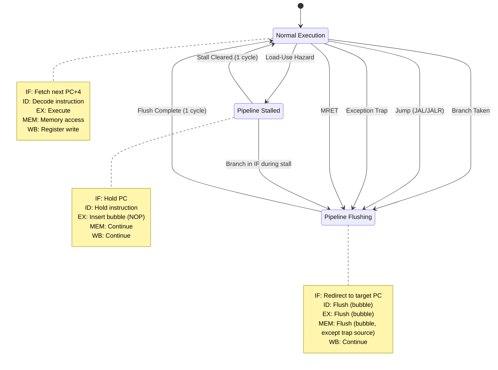

---

### 4.2 Stall Signal Propagation

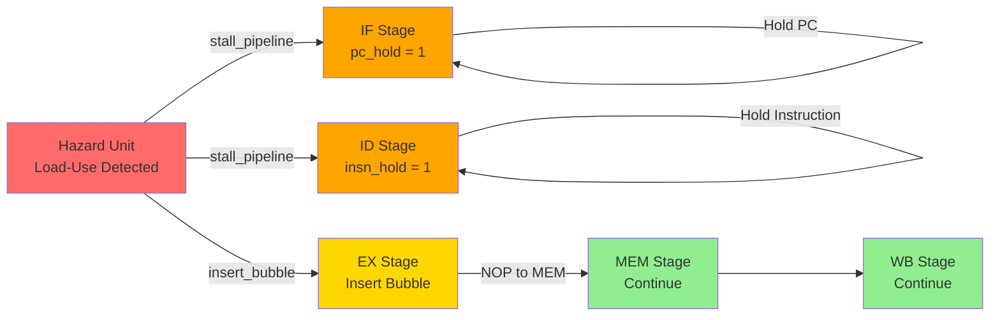

**Stall Duration:** 1 cycle (load result available in MEM stage for forwarding).

---

### 4.3 Flush Signal Propagation

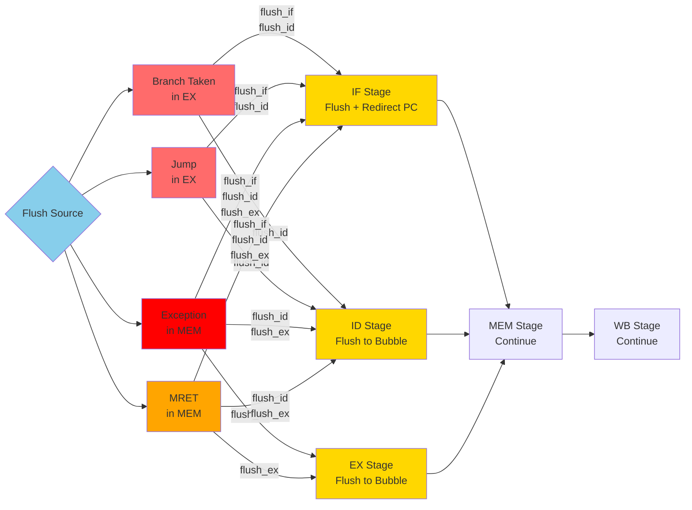

**Flush Scope:**
- **Branch/Jump (EX):** Flush IF, ID (2 stages)
- **Trap/MRET (MEM):** Flush IF, ID, EX (3 stages)

---

## Branch/Jump Control Flow

### 5.1 Branch Decision Flow

```mermaid
flowchart TD
    START([Branch Instruction<br/>in EX Stage])
    
    COMPARE[Branch Comparator<br/>Evaluate Condition]
    
    BEQ{BEQ:<br/>rs1 == rs2?}
    BNE{BNE:<br/>rs1 != rs2?}
    BLT{BLT:<br/>rs1 < rs2<br/>(signed)?}
    BGE{BGE:<br/>rs1 >= rs2<br/>(signed)?}
    BLTU{BLTU:<br/>rs1 < rs2<br/>(unsigned)?}
    BGEU{BGEU:<br/>rs1 >= rs2<br/>(unsigned)?}
    
    TAKEN[Branch Taken<br/>PC = PC + imm]
    NOT_TAKEN[Branch Not Taken<br/>PC = PC + 4]
    
    FLUSH_IF[Flush IF Stage]
    FLUSH_ID[Flush ID Stage]
    
    UPDATE_PC[Update PC in IF]
    
    END([Continue Execution])
    
    START --> COMPARE
    
    COMPARE --> BEQ
    COMPARE --> BNE
    COMPARE --> BLT
    COMPARE --> BGE
    COMPARE --> BLTU
    COMPARE --> BGEU
    
    BEQ -->|Equal| TAKEN
    BEQ -->|Not Equal| NOT_TAKEN
    
    BNE -->|Not Equal| TAKEN
    BNE -->|Equal| NOT_TAKEN
    
    BLT -->|Less| TAKEN
    BLT -->|Greater/Equal| NOT_TAKEN
    
    BGE -->|Greater/Equal| TAKEN
    BGE -->|Less| NOT_TAKEN
    
    BLTU -->|Less| TAKEN
    BLTU -->|Greater/Equal| NOT_TAKEN
    
    BGEU -->|Greater/Equal| TAKEN
    BGEU -->|Less| NOT_TAKEN
    
    TAKEN --> FLUSH_IF
    TAKEN --> FLUSH_ID
    FLUSH_IF --> UPDATE_PC
    FLUSH_ID --> UPDATE_PC
    
    NOT_TAKEN --> END
    UPDATE_PC --> END
    
    style TAKEN fill:#ff6b6b
    style NOT_TAKEN fill:#90ee90
    style FLUSH_IF fill:#ffd700
    style FLUSH_ID fill:#ffd700
```

**Branch Penalty:**
- **Taken:** 2 cycles (flush IF, ID)
- **Not Taken:** 0 cycles (sequential execution)

---

### 5.2 Jump Flow (JAL/JALR)

```mermaid
flowchart TD
    START([Jump Instruction<br/>in EX Stage])
    
    JAL{Instruction<br/>Type?}
    
    JAL_TARGET[JAL:<br/>target = PC + imm<br/>rd = PC + 4]
    JALR_TARGET[JALR:<br/>target = (rs1 + imm) & ~1<br/>rd = PC + 4]
    
    FLUSH_IF[Flush IF Stage]
    FLUSH_ID[Flush ID Stage]
    
    UPDATE_PC[Update PC to target]
    SAVE_RA[Save return address<br/>to rd (link register)]
    
    END([Continue at Target])
    
    START --> JAL
    
    JAL -->|JAL| JAL_TARGET
    JAL -->|JALR| JALR_TARGET
    
    JAL_TARGET --> FLUSH_IF
    JALR_TARGET --> FLUSH_IF
    
    JAL_TARGET --> SAVE_RA
    JALR_TARGET --> SAVE_RA
    
    FLUSH_IF --> FLUSH_ID
    FLUSH_ID --> UPDATE_PC
    
    UPDATE_PC --> END
    SAVE_RA --> END
    
    style JAL_TARGET fill:#87ceeb
    style JALR_TARGET fill:#87ceeb
    style FLUSH_IF fill:#ffd700
    style FLUSH_ID fill:#ffd700
    style SAVE_RA fill:#90ee90
```

**Jump Penalty:** Always 2 cycles (unconditional redirect).

**JALR LSB Clear:** Target address bit [0] cleared to ensure instruction alignment.

---

## Exception Trap Sequence

### 6.1 Exception Detection and Trap Flow

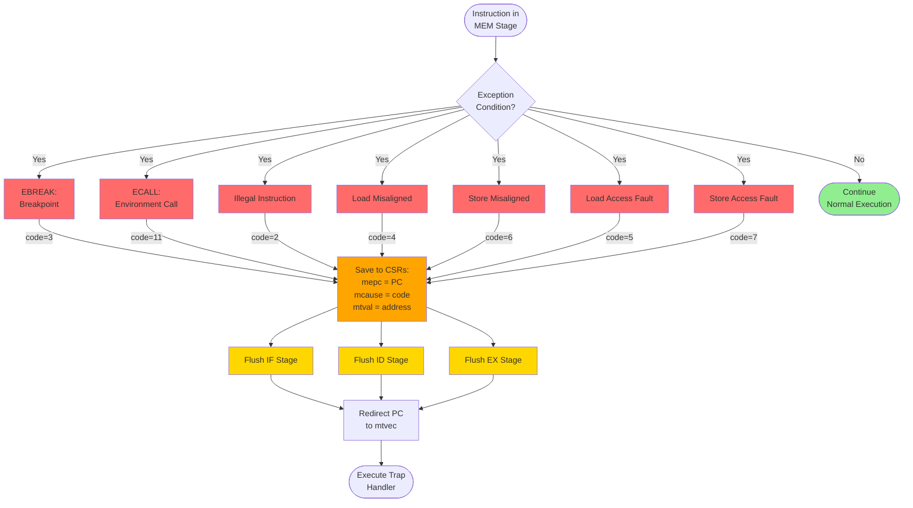

**Exception Priority (highest to lowest):**
1. Instruction fetch exceptions (not implemented)
2. Illegal instruction (ID stage)
3. Breakpoint (EBREAK)
4. Load/Store address misaligned
5. Load/Store access fault
6. Environment call (ECALL)

---

### 6.2 Exception State Machine

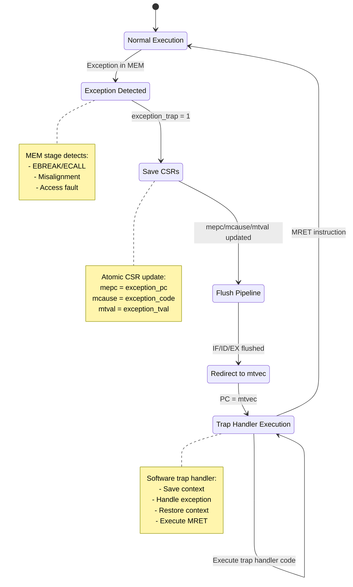

---

## MRET Return Sequence

### 7.1 MRET Flow

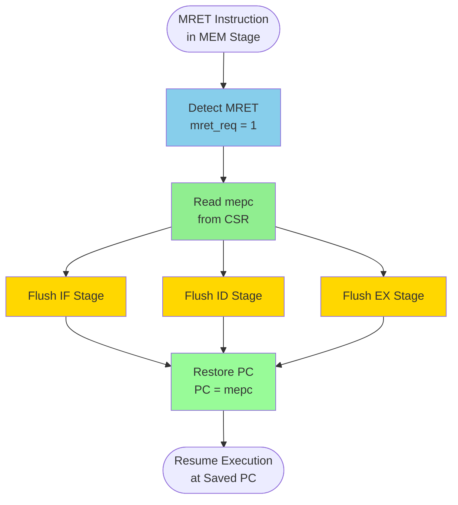

**MRET Characteristics:**
- **Privilege:** Machine-mode only (no privilege change in M-only core)
- **PC Restore:** Jumps to mepc (saved exception PC)
- **Pipeline Flush:** 3 stages (IF/ID/EX)
- **CSR Preservation:** mepc/mcause/mtval remain unchanged

---

### 7.2 Exception-MRET Round Trip

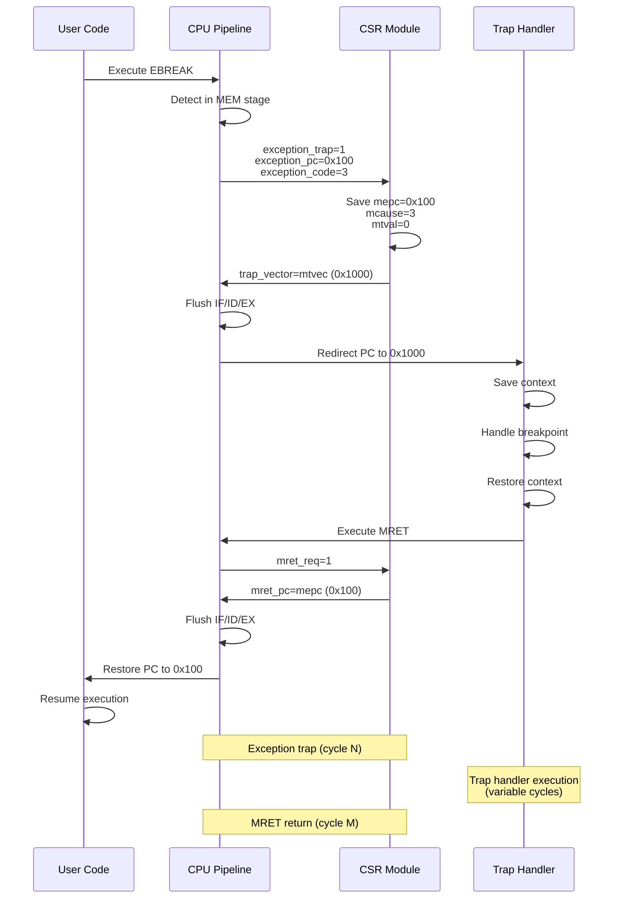

---

## Memory Arbitration State Machine

### 8.1 Block RAM Port B Arbiter

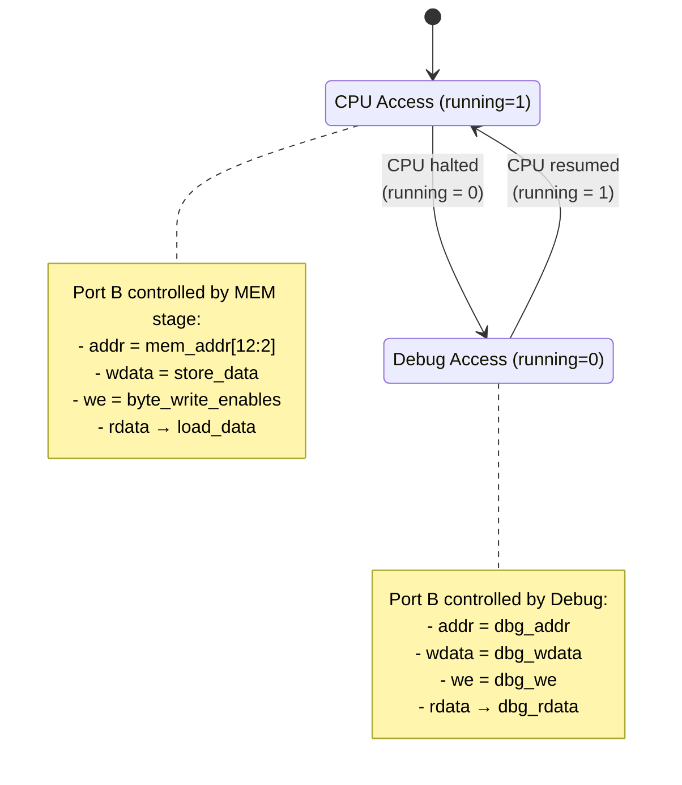

**Arbitration Logic:**
```systemverilog
assign ram_port_b_addr  = running ? mem_addr : dbg_addr;
assign ram_port_b_wdata = running ? mem_wdata : dbg_wdata;
assign ram_port_b_we    = running ? mem_we : dbg_we;
```

**Port Assignment:**
- **Port A:** IF stage (instruction fetch, read-only)
- **Port B:** MEM stage (data access) or Debug (when halted)

---

## References

### Related Module Specifications
- **[rv32i_if_spec.md](../rtl/cpu/rv32i_if_spec.md)** - PC control, branch redirect
- **[rv32i_hazard_spec.md](../rtl/cpu/rv32i_hazard_spec.md)** - RAW detection, forwarding
- **[rv32i_ex_spec.md](../rtl/cpu/rv32i_ex_spec.md)** - Branch comparator, jump target
- **[rv32i_mem_spec.md](../rtl/cpu/rv32i_mem_spec.md)** - Exception detection
- **[rv32i_csr_spec.md](../rtl/cpu/rv32i_csr_spec.md)** - Exception trap, MRET handling

### Architecture Documents
- **[rv32i_modular_architecture_spec.md](rv32i_modular_architecture_spec.md)** - Overall architecture
- **[rv32i_pipeline_interfaces.md](rv32i_pipeline_interfaces.md)** - Pipeline register structures

### Verification References
- **Assertion Modules:** All state transitions and control flow decisions covered by SVA
- **UVM Sequences:** Test scenarios exercising each control path
- **Coverage Models:** FSM state coverage and transition coverage

---

**Document Version:** 1.0  
**Last Updated:** 2026-01-04  
**Status:** Design Phase - Pre-Implementation
