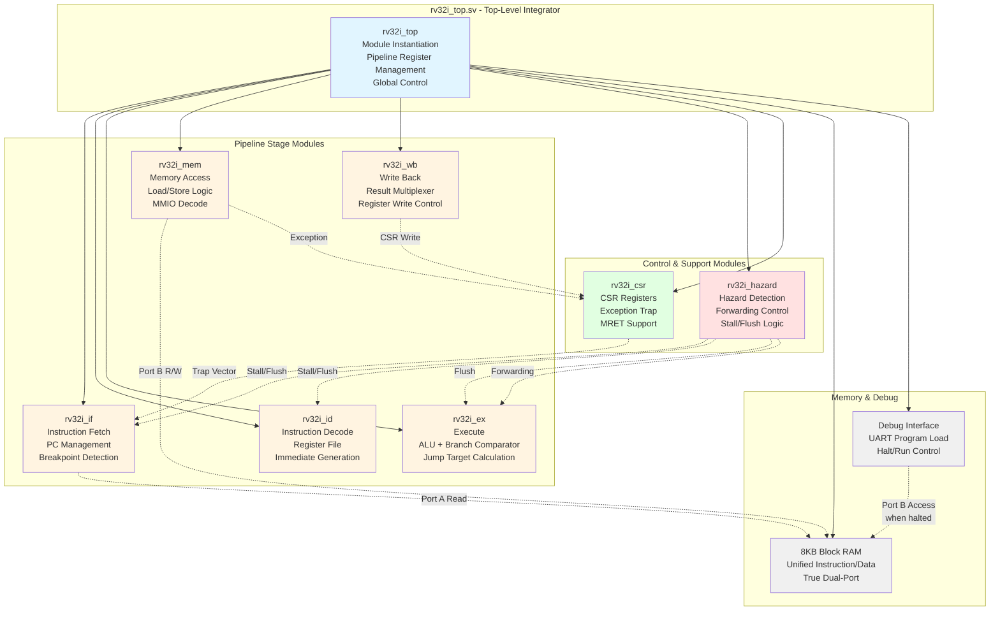
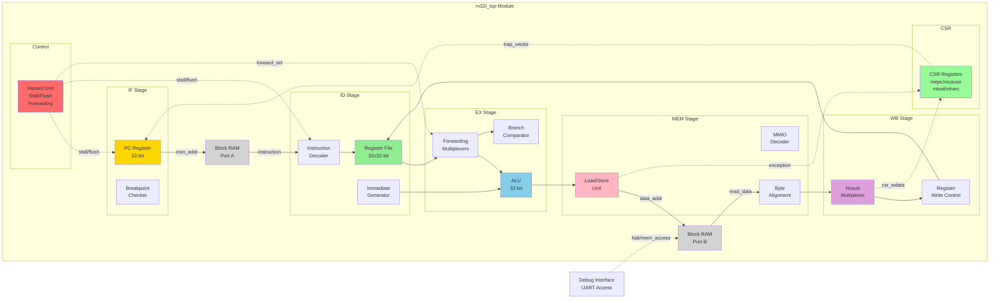
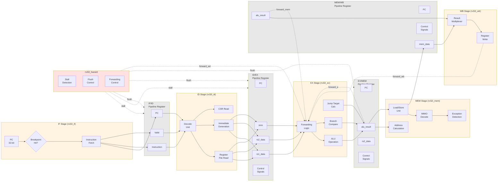
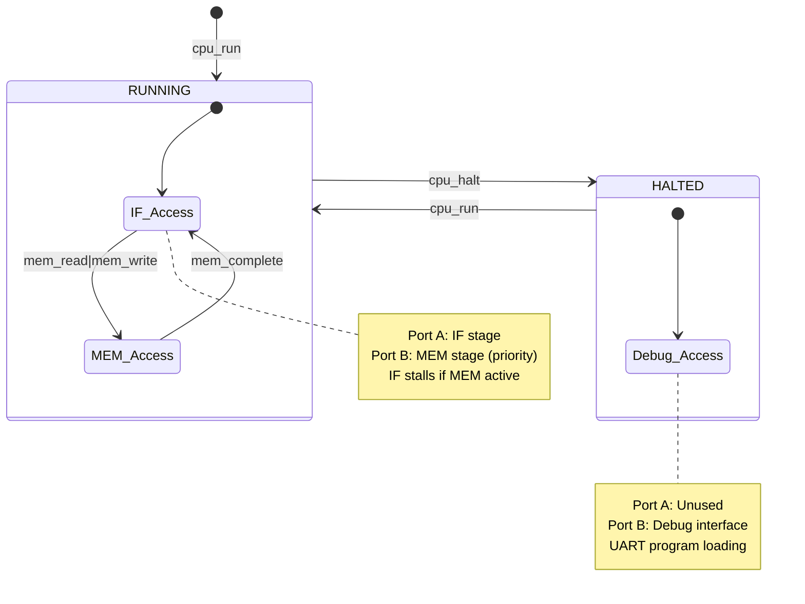
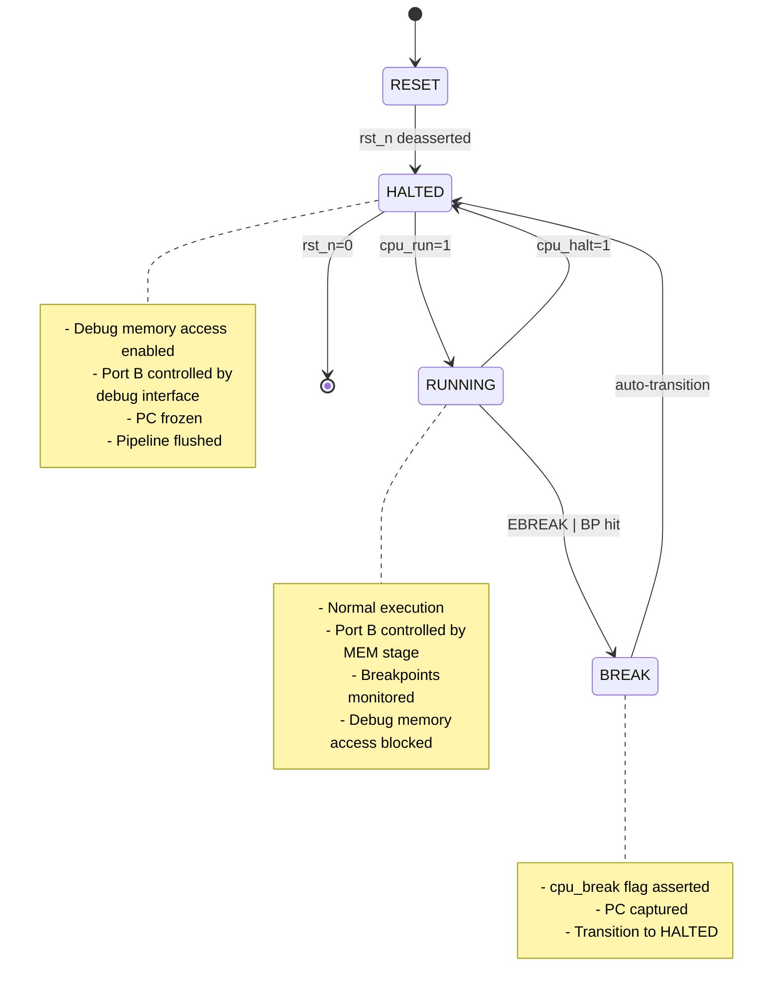

# RV32I Modular Architecture Specification

**Document Version:** 1.0  
**Date:** January 4, 2026  
**Status:** Design Phase - Pre-Implementation  
**Author:** System Architecture Team

---

## Table of Contents

1. [Overview](#overview)
2. [Module Hierarchy](#module-hierarchy)
3. [Top-Level Architecture Block Diagram](#top-level-architecture-block-diagram)
4. [Pipeline Dataflow Diagram](#pipeline-dataflow-diagram)
5. [Module Inventory](#module-inventory)
6. [Inter-Module Interfaces](#inter-module-interfaces)
7. [Pipeline Register Structures](#pipeline-register-structures)
8. [Memory Architecture](#memory-architecture)
9. [Debug Interface](#debug-interface)
10. [Design Rationale](#design-rationale)
11. [Verification Strategy](#verification-strategy)
12. [References](#references)

---

## Overview

This document specifies the modular architecture for the RV32I RISC-V processor core. The design refactors the monolithic `rv32i_core` (1522 lines) into 7 separate, testable modules following stage-based separation of concerns.

### Design Goals

1. **Maintainability:** Clear module boundaries with well-defined interfaces
2. **Testability:** Each module independently verifiable with unit-level assertions
3. **Synthesis Optimization:** Per-stage timing closure and resource optimization
4. **Debugging:** Hierarchical signal access for waveform analysis
5. **Specification Clarity:** Executable SVA specifications per module

### Key Constraints Preserved

- **Unified 8KB Block RAM:** Von Neumann architecture with IF/MEM stage arbitration
- **UART Debug Interface:** Program loading and debugging via Register_Block
- **Pre-Computed Forwarding:** ID-stage forwarding control (Phase 2B optimization)
- **CSR Exception Handling:** Existing rv32i_csr module unchanged
- **MMIO LED Register:** 0x407C byte address mapping in MEM stage

---

## Module Hierarchy



---

## Top-Level Architecture Block Diagram



---

## Pipeline Dataflow Diagram



---

## Module Inventory

| Module | File | Lines (Est.) | Responsibilities | Assertion Module |
|--------|------|--------------|------------------|------------------|
| **rv32i_top** | rtl/cpu/rv32i_top.sv | 400 | Top-level integrator, pipeline register instantiation, global control | N/A (structural only) |
| **rv32i_if** | rtl/cpu/rv32i_if.sv | 150 | PC management, instruction fetch, hardware breakpoint detection | rv32i_if_timing_spec.sv |
| **rv32i_id** | rtl/cpu/rv32i_id.sv | 300 | Instruction decode, register file, immediate generation, CSR read interface | rv32i_id_timing_spec.sv |
| **rv32i_ex** | rtl/cpu/rv32i_ex.sv | 250 | ALU operations, branch comparison, jump target calculation, forwarding muxes | rv32i_ex_timing_spec.sv |
| **rv32i_mem** | rtl/cpu/rv32i_mem.sv | 400 | Load/store unit, byte alignment, MMIO decode (LED), exception detection | rv32i_mem_timing_spec.sv |
| **rv32i_wb** | rtl/cpu/rv32i_wb.sv | 100 | Result multiplexer, register write control | rv32i_wb_timing_spec.sv |
| **rv32i_hazard** | rtl/cpu/rv32i_hazard.sv | 200 | RAW hazard detection, load-use stall, forwarding control, pipeline flush | rv32i_hazard_timing_spec.sv |
| **rv32i_csr** | rtl/cpu/rv32i_csr.sv | 200 | CSR registers (mepc, mcause, mtval, mtvec), exception trap, MRET | rv32i_csr_timing_spec.sv ✅ |

**Total Estimated Lines:** ~2000 (vs. current 1522 monolithic)  
**Overhead:** ~478 lines (+31%) for explicit interfaces and hierarchy

---

## Inter-Module Interfaces

### 6.1 rv32i_if Module Interface

```systemverilog
module rv32i_if (
    input  logic        clk,
    input  logic        rst_n,
    
    // Control inputs from hazard unit
    input  logic        if_stall,
    input  logic        if_flush,
    
    // PC redirection inputs
    input  logic        branch_taken,        // From EX stage
    input  logic [31:0] branch_target,
    input  logic        trap_redirect,       // From CSR
    input  logic [31:0] trap_vector,
    
    // Instruction memory interface (Port A)
    output logic [10:0] insn_ram_addr,       // Word address (2048 words)
    input  logic [31:0] insn_ram_rdata,
    
    // Hardware breakpoint interface
    input  logic [3:0]  dbg_bp_enable,
    input  logic [31:0] dbg_bp_addr[4],
    output logic [3:0]  dbg_bp_hit,
    
    // IF/ID pipeline register outputs
    output logic        if_id_valid,
    output logic [31:0] if_id_pc,
    output logic [31:0] if_id_insn
);
```

**Specification:** See [rtl/cpu/rv32i_if_spec.md](rtl/cpu/rv32i_if_spec.md)

---

### 6.2 rv32i_id Module Interface

```systemverilog
module rv32i_id (
    input  logic        clk,
    input  logic        rst_n,
    
    // IF/ID pipeline register inputs
    input  logic        if_id_valid,
    input  logic [31:0] if_id_pc,
    input  logic [31:0] if_id_insn,
    
    // Control from hazard unit
    input  logic        id_stall,
    input  logic        id_flush,
    
    // Register file write interface (from WB stage)
    input  logic        rf_wen,
    input  logic [4:0]  rf_waddr,
    input  logic [31:0] rf_wdata,
    
    // CSR read interface
    output logic [11:0] csr_raddr,
    input  logic [31:0] csr_rdata,
    
    // Hazard detection outputs
    output logic [4:0]  id_rs1_addr,
    output logic [4:0]  id_rs2_addr,
    output logic [4:0]  id_rd_addr,
    output logic        id_rf_wen,
    
    // ID/EX pipeline register outputs
    output logic        id_ex_valid,
    output logic [31:0] id_ex_pc,
    output logic [31:0] id_ex_insn,
    output logic [31:0] id_ex_rs1_data,
    output logic [31:0] id_ex_rs2_data,
    output logic [31:0] id_ex_imm,
    output logic [31:0] id_ex_csr_rdata,
    output id_ex_ctrl_t id_ex_ctrl           // Control signal structure
);
```

**Specification:** See [rtl/cpu/rv32i_id_spec.md](rtl/cpu/rv32i_id_spec.md)

---

### 6.3 rv32i_ex Module Interface

```systemverilog
module rv32i_ex (
    input  logic        clk,
    input  logic        rst_n,
    
    // ID/EX pipeline register inputs
    input  logic        id_ex_valid,
    input  logic [31:0] id_ex_pc,
    input  logic [31:0] id_ex_insn,
    input  logic [31:0] id_ex_rs1_data,
    input  logic [31:0] id_ex_rs2_data,
    input  logic [31:0] id_ex_imm,
    input  id_ex_ctrl_t id_ex_ctrl,
    
    // Forwarding inputs from hazard unit
    input  logic [1:0]  forward_rs1_sel,     // 00=ID, 01=EX, 10=MEM, 11=WB
    input  logic [1:0]  forward_rs2_sel,
    
    // Forwarding data inputs
    input  logic [31:0] ex_forward_data,     // From EX/MEM register
    input  logic [31:0] mem_forward_data,    // From MEM/WB register
    input  logic [31:0] wb_forward_data,     // From WB result
    
    // Control from hazard unit
    input  logic        ex_flush,
    
    // Branch/jump outputs to IF stage
    output logic        branch_taken,
    output logic [31:0] branch_target,
    
    // EX/MEM pipeline register outputs
    output logic        ex_mem_valid,
    output logic [31:0] ex_mem_pc,
    output logic [31:0] ex_mem_insn,
    output logic [31:0] ex_mem_alu_result,
    output logic [31:0] ex_mem_rs2_data,     // For stores
    output ex_mem_ctrl_t ex_mem_ctrl
);
```

**Specification:** See [rtl/cpu/rv32i_ex_spec.md](rtl/cpu/rv32i_ex_spec.md)

---

### 6.4 rv32i_mem Module Interface

```systemverilog
module rv32i_mem (
    input  logic        clk,
    input  logic        rst_n,
    
    // EX/MEM pipeline register inputs
    input  logic        ex_mem_valid,
    input  logic [31:0] ex_mem_pc,
    input  logic [31:0] ex_mem_insn,
    input  logic [31:0] ex_mem_alu_result,   // Used as memory address
    input  logic [31:0] ex_mem_rs2_data,
    input  ex_mem_ctrl_t ex_mem_ctrl,
    
    // Data memory interface (Port B - when running)
    output logic [10:0] data_ram_addr,       // Word address
    output logic [31:0] data_ram_wdata,
    output logic [3:0]  data_ram_we,         // Byte write enables
    input  logic [31:0] data_ram_rdata,
    
    // MMIO outputs
    output logic [3:0]  led_out,             // LED register at 0x407C
    
    // Exception outputs to CSR
    output logic        exception_trap,
    output logic [31:0] exception_pc,
    output logic [3:0]  exception_code,
    output logic [31:0] exception_tval,
    
    // MEM/WB pipeline register outputs
    output logic        mem_wb_valid,
    output logic [31:0] mem_wb_pc,
    output logic [31:0] mem_wb_insn,
    output logic [31:0] mem_wb_mem_data,     // Load result
    output logic [31:0] mem_wb_alu_result,   // Pass-through for non-loads
    output mem_wb_ctrl_t mem_wb_ctrl
);
```

**Specification:** See [rtl/cpu/rv32i_mem_spec.md](rtl/cpu/rv32i_mem_spec.md)

---

### 6.5 rv32i_wb Module Interface

```systemverilog
module rv32i_wb (
    input  logic        clk,
    input  logic        rst_n,
    
    // MEM/WB pipeline register inputs
    input  logic        mem_wb_valid,
    input  logic [31:0] mem_wb_pc,
    input  logic [31:0] mem_wb_insn,
    input  logic [31:0] mem_wb_mem_data,
    input  logic [31:0] mem_wb_alu_result,
    input  logic [31:0] mem_wb_csr_rdata,    // From CSR read
    input  mem_wb_ctrl_t mem_wb_ctrl,
    
    // Register file write interface (to ID stage)
    output logic        rf_wen,
    output logic [4:0]  rf_waddr,
    output logic [31:0] rf_wdata,
    
    // CSR write interface
    output logic        csr_wen,
    output logic [11:0] csr_waddr,
    output logic [31:0] csr_wdata,
    
    // Forwarding output (to hazard unit)
    output logic [31:0] wb_result           // Final writeback value
);
```

**Specification:** See [rtl/cpu/rv32i_wb_spec.md](rtl/cpu/rv32i_wb_spec.md)

---

### 6.6 rv32i_hazard Module Interface

```systemverilog
module rv32i_hazard (
    input  logic        clk,
    input  logic        rst_n,
    
    // Pipeline valid signals
    input  logic        if_valid,
    input  logic        id_valid,
    input  logic        ex_valid,
    input  logic        mem_valid,
    input  logic        wb_valid,
    
    // ID stage register addresses
    input  logic [4:0]  id_rs1_addr,
    input  logic [4:0]  id_rs2_addr,
    input  logic [4:0]  id_rd_addr,
    input  logic        id_rf_wen,
    input  logic        id_is_load,
    
    // EX stage register addresses
    input  logic [4:0]  ex_rd_addr,
    input  logic        ex_rf_wen,
    
    // MEM stage register addresses
    input  logic [4:0]  mem_rd_addr,
    input  logic        mem_rf_wen,
    
    // WB stage register addresses
    input  logic [4:0]  wb_rd_addr,
    input  logic        wb_rf_wen,
    
    // Branch/jump control
    input  logic        branch_taken,
    input  logic        jump_req,
    input  logic        trap_redirect,
    
    // Stall/flush outputs
    output logic        if_stall,
    output logic        id_stall,
    output logic        if_flush,
    output logic        id_flush,
    output logic        ex_flush,
    
    // Forwarding control outputs
    output logic [1:0]  forward_rs1_sel,
    output logic [1:0]  forward_rs2_sel
);
```

**Specification:** See [rtl/cpu/rv32i_hazard_spec.md](rtl/cpu/rv32i_hazard_spec.md)

---

## Pipeline Register Structures

### 7.1 Control Signal Structure

```systemverilog
// Package: rv32i_pipeline_pkg.sv

typedef struct packed {
    // ALU control
    logic [3:0]  alu_op;           // ALU operation selector
    logic        alu_src1_sel;     // 0=rs1, 1=PC
    logic        alu_src2_sel;     // 0=rs2, 1=imm
    
    // Branch/Jump control
    logic        is_branch;
    logic        is_jal;
    logic        is_jalr;
    
    // Memory control
    logic        mem_read;
    logic        mem_write;
    logic [2:0]  mem_size;         // 000=byte, 001=half, 010=word
    logic        mem_unsigned;     // For LBU/LHU
    
    // Register file control
    logic        rf_wen;
    logic [1:0]  rf_wdata_sel;     // 00=ALU, 01=mem, 10=PC+4, 11=CSR
    
    // CSR control
    logic        is_csr;
    logic [1:0]  csr_op;           // 00=RW, 01=RS, 10=RC
    
    // Exception control
    logic        is_ebreak;
    logic        is_ecall;
    logic        is_mret;
    logic        is_illegal;
} ctrl_signals_t;
```

### 7.2 IF/ID Pipeline Register

```systemverilog
typedef struct packed {
    logic        valid;
    logic [31:0] pc;
    logic [31:0] insn;
} if_id_reg_t;
```

### 7.3 ID/EX Pipeline Register

```systemverilog
typedef struct packed {
    logic        valid;
    logic [31:0] pc;
    logic [31:0] insn;
    logic [31:0] rs1_data;
    logic [31:0] rs2_data;
    logic [31:0] imm;
    logic [31:0] csr_rdata;
    logic [4:0]  rd_addr;
    ctrl_signals_t ctrl;
} id_ex_reg_t;
```

### 7.4 EX/MEM Pipeline Register

```systemverilog
typedef struct packed {
    logic        valid;
    logic [31:0] pc;
    logic [31:0] insn;
    logic [31:0] alu_result;
    logic [31:0] rs2_data;        // For store instructions
    logic [4:0]  rd_addr;
    ctrl_signals_t ctrl;
} ex_mem_reg_t;
```

### 7.5 MEM/WB Pipeline Register

```systemverilog
typedef struct packed {
    logic        valid;
    logic [31:0] pc;
    logic [31:0] insn;
    logic [31:0] mem_data;
    logic [31:0] alu_result;
    logic [31:0] csr_rdata;
    logic [4:0]  rd_addr;
    ctrl_signals_t ctrl;
} mem_wb_reg_t;
```

**Complete Specification:** See [docs/rv32i_pipeline_interfaces.md](docs/rv32i_pipeline_interfaces.md)

---

## Memory Architecture

### 8.1 Unified Block RAM Organization

```
┌──────────────────────────────────────────────────────┐
│        Unified 8KB Block RAM (2048 × 32-bit)         │
│                                                       │
│  Byte Address Range: 0x0000_0000 - 0x0000_1FFF       │
│  Word Address Range: 0x000 - 0x7FF (11-bit)          │
├──────────────────────────────────────────────────────┤
│  Port A (Read-Only):  Instruction Fetch (IF stage)   │
│  Port B (Read/Write): Data Memory (MEM stage) OR     │
│                       Debug Access (when halted)     │
└──────────────────────────────────────────────────────┘
```

### 8.2 Memory Arbitration Logic



### 8.3 Address Translation

**Byte Address to Word Address:**
```systemverilog
// IF stage (instruction fetch)
assign insn_ram_addr = pc_if[12:2];  // Word address [10:0]

// MEM stage (data access)
assign data_ram_addr = mem_addr[12:2];  // Word address [10:0]

// Debug interface
assign debug_ram_addr = dbg_mem_addr[10:0];  // Already word address
```

**MMIO Address Decode:**
```systemverilog
// LED register at byte address 0x407C
localparam LED_ADDR = 32'h0000_407C;

assign mmio_led_hit = (mem_addr == LED_ADDR) && mem_write;
```

---

## Debug Interface

### 9.1 Debug Interface Signals (Must Preserve)

```systemverilog
// Top-level rv32i_top interface
module rv32i_top (
    input  logic        clk,
    input  logic        rst_n,
    
    // === Debug Control Interface ===
    input  logic        cpu_run,             // Start/resume execution
    input  logic        cpu_halt,            // Halt execution request
    output logic        cpu_halted,          // CPU halted status
    output logic        cpu_break,           // EBREAK/breakpoint detected
    
    // === Debug Memory Interface (11-bit word address) ===
    input  logic [10:0] dbg_mem_addr,        // Word address (0-2047)
    input  logic [31:0] dbg_mem_wdata,       // Write data
    output logic [31:0] dbg_mem_rdata,       // Read data (registered)
    input  logic [3:0]  dbg_mem_we,          // Byte write enables
    input  logic        dbg_mem_re,          // Read enable
    
    // === Hardware Breakpoint Interface ===
    input  logic [3:0]  dbg_bp_enable,       // Breakpoint enable[3:0]
    input  logic [31:0] dbg_bp_addr[4],      // Breakpoint addresses
    output logic [3:0]  dbg_bp_hit,          // Breakpoint hit flags
    
    // === MMIO LED Output ===
    output logic [3:0]  led_out              // LED register output
);
```

### 9.2 Debug State Machine



### 9.3 UART Integration Path

```
UART RX → Frame_Parser → Axi4_Lite_Master → Register_Block
                                              ↓
                                        Debug Control Registers
                                              ↓
                                    rv32i_top.dbg_* signals
                                              ↓
                              Block RAM Port B (when halted)
```

**Critical Requirement:** Debug interface signals must remain unchanged to maintain compatibility with `Register_Block.sv` and UART communication infrastructure.

---

## Design Rationale

### 10.1 Why 7 Modules?

1. **Stage-Based Separation (5 modules):** Natural alignment with 5-stage pipeline (IF/ID/EX/MEM/WB)
2. **Hazard Control (1 module):** Complex combinational logic benefits from isolation
3. **CSR Support (1 module):** Already separate, follows same pattern

**Why Not More?**
- **RegisterFile:** Small (32×32-bit), tightly coupled to ID stage decode logic
- **ALU:** Integrated in EX stage with forwarding multiplexers (tight timing)
- **LoadStoreUnit:** Part of MEM stage, shares exception detection logic

**Why Not Fewer?**
- Monolithic design (current 1522 lines) difficult to maintain
- Per-stage optimization enables better synthesis results
- Unit-level testing requires module boundaries

---

### 10.2 Pre-Computed Forwarding Rationale

**Reference Design:** Forwarding logic in EX stage (combinational)

**Current/Proposed Design:** Forwarding control computed in ID stage, registered in ID/EX

**Justification:**
```
Critical Path Analysis:
  Reference: RF_Read → Decode → Hazard → Fwd_Mux → ALU
  Current:   RF_Read → Decode → Hazard (registered) → Fwd_Mux → ALU
  
Benefit: Removes hazard detection from ALU critical path
Overhead: 1-cycle forwarding latency (acceptable for correctness)
```

**Trade-off:** Slightly more conservative forwarding in exchange for higher Fmax.

---

### 10.3 Unified Memory vs. Harvard Architecture

**Harvard (Reference):** Separate instruction and data memory
**Von Neumann (Current/Proposed):** Unified 8KB Block RAM

**Constraint:** FPGA Block RAM resources limited

```
Option A (Harvard):
  - 2KB instruction memory (512 words)
  - 2KB data memory (512 words)
  - Total: 4KB, no arbitration
  
Option B (Unified):
  - 8KB unified memory (2048 words)
  - Requires IF/MEM arbitration
  - Larger program capacity
```

**Decision:** Unified memory for 4× program capacity at cost of arbitration logic.

---

### 10.4 CSR Module Preservation

**Rationale:**
1. **Already Well-Separated:** 200 lines, clean interface
2. **Exception Handling:** Complex state machine benefits from encapsulation
3. **RISC-V Compliance:** CSR behavior standardized, minimal coupling
4. **Verification:** Existing CSR assertions extensive (rv32i_csr_timing_spec.sv)

**Interface Stability:** No changes required, serves as architectural template.

---

## Verification Strategy

### 11.1 Assertion Coverage by Module

| Module | Assertion Module | Key Properties Verified |
|--------|------------------|-------------------------|
| rv32i_if | rv32i_if_timing_spec.sv | PC increment, branch redirection, breakpoint hit detection |
| rv32i_id | rv32i_id_timing_spec.sv | Decode correctness, x0 hardwire, register read timing, immediate generation |
| rv32i_ex | rv32i_ex_timing_spec.sv | ALU operation correctness, branch condition evaluation, forwarding mux selection |
| rv32i_mem | rv32i_mem_timing_spec.sv | Byte alignment, load sign-extension, store write enables, MMIO address decode |
| rv32i_wb | rv32i_wb_timing_spec.sv | Result mux selection, register write visibility, CSR write timing |
| rv32i_hazard | rv32i_hazard_timing_spec.sv | RAW hazard detection, load-use stall, forwarding priority, flush propagation |
| rv32i_csr | rv32i_csr_timing_spec.sv ✅ | CSR write latency, trap vector redirect, MRET PC restoration |

### 11.2 Verification Phases

**Phase 1: Assertion Development (Current)**
- Write SVA specifications against monolithic rv32i_core
- Use hierarchical bind with placeholder paths
- Verify assertions pass with current implementation

**Phase 2: Module Extraction**
- Extract modules one-by-one (IF → ID → EX → MEM → WB → HAZARD)
- Update bind files with actual hierarchical paths
- Run targeted assertion regression per module

**Phase 3: Integration Testing**
- Full pipeline regression with all 13 RV32I tests
- Coverage analysis per module
- Waveform comparison (before/after refactoring)

### 11.3 Success Criteria

1. **Functional Equivalence:** All 13 existing tests pass unchanged
2. **Assertion Coverage:** 100% of critical timing properties verified
3. **Synthesis Results:** Fmax ≥ current (no degradation)
4. **Resource Usage:** LUT count within ±10% of current
5. **Waveform Match:** Cycle-accurate equivalence for basic test

---

## References

### 12.1 Related Documents

- **[RV32I_DOCUMENTATION.md](rtl/cpu/RV32I_DOCUMENTATION.md)** - Current monolithic implementation
- **[rv32i_migration_diary.md](docs/rv32i_migration_diary.md)** - Migration history and decisions
- **[ISA.md](docs/ISA.md)** - RV32I instruction set specification
- **[exception_trap_timing_spec.md](docs/exception_trap_timing_spec.md)** - Exception handling timing
- **[rv32i_pipeline_interfaces.md](docs/rv32i_pipeline_interfaces.md)** - Pipeline register specifications
- **[rv32i_control_flow_diagrams.md](docs/rv32i_control_flow_diagrams.md)** - Control logic diagrams

### 12.2 Module Specifications

- **[rv32i_if_spec.md](rtl/cpu/rv32i_if_spec.md)** - Instruction Fetch stage
- **[rv32i_id_spec.md](rtl/cpu/rv32i_id_spec.md)** - Instruction Decode stage
- **[rv32i_ex_spec.md](rtl/cpu/rv32i_ex_spec.md)** - Execute stage
- **[rv32i_mem_spec.md](rtl/cpu/rv32i_mem_spec.md)** - Memory Access stage
- **[rv32i_wb_spec.md](rtl/cpu/rv32i_wb_spec.md)** - Write Back stage
- **[rv32i_hazard_spec.md](rtl/cpu/rv32i_hazard_spec.md)** - Hazard Detection unit
- **[rv32i_csr_spec.md](rtl/cpu/rv32i_csr_spec.md)** - CSR module (existing)

### 12.3 Assertion Modules

- **[rv32i_if_timing_spec.sv](sim/assertions/rv32i_if_timing_spec.sv)** - IF stage assertions
- **[rv32i_id_timing_spec.sv](sim/assertions/rv32i_id_timing_spec.sv)** - ID stage assertions
- **[rv32i_ex_timing_spec.sv](sim/assertions/rv32i_ex_timing_spec.sv)** - EX stage assertions
- **[rv32i_mem_timing_spec.sv](sim/assertions/rv32i_mem_timing_spec.sv)** - MEM stage assertions
- **[rv32i_wb_timing_spec.sv](sim/assertions/rv32i_wb_timing_spec.sv)** - WB stage assertions
- **[rv32i_hazard_timing_spec.sv](sim/assertions/rv32i_hazard_timing_spec.sv)** - Hazard unit assertions
- **[rv32i_csr_timing_spec.sv](sim/assertions/rv32i_csr_timing_spec.sv)** - CSR assertions ✅

### 12.4 Reference Design

- **[Reference RV32I Multi-Cycle Processor](reference/RV32I/src/multi_cycle_processor/)** - Hariesh Anbalagan implementation

---

**Document End**

*This document serves as the authoritative specification for the RV32I modular architecture. All RTL implementation, assertion development, and verification activities must reference this specification.*

*For questions or clarifications, refer to the module-specific specification documents listed in Section 12.2.*

---

**Revision History:**

| Version | Date | Author | Changes |
|---------|------|--------|---------|
| 1.0 | 2026-01-04 | Architecture Team | Initial specification with Mermaid diagrams |
