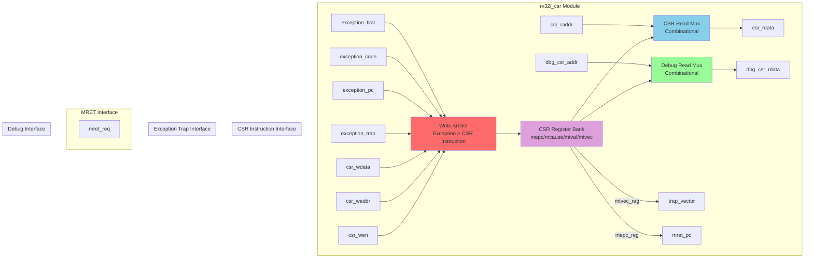

# RV32I Control and Status Register (CSR) Module Specification

**Module Name:** `rv32i_csr`  
**File:** `rtl/cpu/rv32i_csr.sv`  
**Version:** 1.0  
**Date:** January 4, 2026  
**Assertion Module:** `sim/assertions/rv32i_csr_timing_spec.sv`

---

## Table of Contents

1. [Overview](#overview)
2. [Block Diagram](#block-diagram)
3. [Interface Signals](#interface-signals)
4. [Functional Description](#functional-description)
5. [CSR Register Bank](#csr-register-bank)
6. [Timing Diagrams](#timing-diagrams)
7. [Exception Conditions](#exception-conditions)
8. [Verification Points](#verification-points)
9. [References](#references)

---

## Overview

The Control and Status Register (CSR) module implements RISC-V Machine Mode CSRs required for exception handling, trap management, and system control. It provides the architectural interface between CPU execution and system-level operations.

### Responsibilities

1. **CSR Storage:** Maintain machine-mode CSR register bank
2. **CSR Instructions:** Support CSRRW/CSRRS/CSRRC read-modify-write operations
3. **Exception Handling:** Automatically save PC/cause on traps
4. **MRET Support:** Restore PC from mepc on exception return
5. **Debug Interface:** External CSR inspection when CPU halted
6. **Trap Vector:** Provide mtvec address for exception redirection

### Key Features

- **4 Machine-Mode CSRs:** mtvec, mepc, mcause, mtval (minimum required set)
- **Atomic Operations:** Read-old-write-new semantics for CSR instructions
- **Priority Arbitration:** Exception writes override CSR instruction writes
- **Combinational Read:** Zero-latency CSR reads for pipeline efficiency
- **Debug Access:** Independent read port for UART/debug interface

---

## Block Diagram



---

## Interface Signals

### Input Signals

| Signal | Width | Source | Description |
|--------|-------|--------|-------------|
| `clk` | 1 | System | System clock |
| `rst_n` | 1 | System | Active-low reset |
| **CSR Instruction Interface** ||||
| `csr_raddr` | 12 | rv32i_id | CSR address to read (combinational) |
| `csr_waddr` | 12 | rv32i_wb | CSR address to write (synchronous) |
| `csr_wdata` | 32 | rv32i_wb | CSR write data |
| `csr_wen` | 1 | rv32i_wb | CSR write enable (WB stage commit) |
| **Exception Trap Interface** ||||
| `exception_trap` | 1 | rv32i_mem | Exception occurred (1-cycle pulse) |
| `exception_pc` | 32 | rv32i_mem | PC of faulting instruction |
| `exception_code` | 5 | rv32i_mem | Exception cause code [4:0] |
| `exception_tval` | 32 | rv32i_mem | Exception value (address/data) |
| **MRET Interface** ||||
| `mret_req` | 1 | rv32i_mem | MRET instruction detected |
| **Debug Interface** ||||
| `dbg_csr_addr` | 12 | Debug Controller | Debug CSR address (when halted) |

### Output Signals

| Signal | Width | Destination | Description |
|--------|-------|-------------|-------------|
| **CSR Instruction Interface** ||||
| `csr_rdata` | 32 | rv32i_id | CSR read data (combinational) |
| **Exception Trap Interface** ||||
| `trap_vector` | 32 | rv32i_if | mtvec value for PC redirect |
| **MRET Interface** ||||
| `mret_pc` | 32 | rv32i_if | mepc value for PC restoration |
| **Debug Interface** ||||
| `dbg_csr_rdata` | 32 | Debug Controller | Debug CSR read data (combinational) |

---

## Functional Description

### 4.1 Write Arbiter with Priority

**Purpose:** Manage simultaneous CSR writes from exception traps and CSR instructions.

**Priority Scheme:**
1. **Exception trap (highest):** Overwrites mepc/mcause/mtval atomically
2. **CSR instruction write (lower):** Commits from WB stage if no exception

```systemverilog
always_ff @(posedge clk or negedge rst_n) begin
    if (!rst_n) begin
        mepc_reg   <= 32'h0000_0000;
        mcause_reg <= 32'h0000_0000;
        mtval_reg  <= 32'h0000_0000;
        mtvec_reg  <= 32'h0000_0000;  // Software initialization required
    end else begin
        // Priority 1: Exception trap (atomic multi-register update)
        if (exception_trap) begin
            mepc_reg   <= exception_pc;
            mcause_reg <= {27'b0, exception_code};  // [31]=0 (exception)
            mtval_reg  <= exception_tval;
            // mtvec_reg not modified during trap
        end
        // Priority 2: CSR instruction write (single register)
        else if (csr_wen) begin
            case (csr_waddr)
                CSR_MTVEC:  mtvec_reg  <= csr_wdata;
                CSR_MEPC:   mepc_reg   <= csr_wdata;
                CSR_MCAUSE: mcause_reg <= csr_wdata;
                CSR_MTVAL:  mtval_reg  <= csr_wdata;
                default: ; // Ignore non-existent CSRs
            endcase
        end
    end
end
```

**Critical Rule:** Exception trap blocks CSR instruction writes in the same cycle.

---

### 4.2 CSR Read Logic (Combinational)

**Purpose:** Provide zero-latency CSR reads for CSRRW/CSRRS/CSRRC instructions in ID stage.

```systemverilog
always_comb begin
    case (csr_raddr)
        CSR_MTVEC:  csr_rdata = mtvec_reg;
        CSR_MEPC:   csr_rdata = mepc_reg;
        CSR_MCAUSE: csr_rdata = mcause_reg;
        CSR_MTVAL:  csr_rdata = mtval_reg;
        default:    csr_rdata = 32'h0000_0000;  // Non-existent CSRs = 0
    endcase
end
```

**Read-Before-Write Semantics:** CSR instruction reads occur in ID stage, writes commit in WB stage (4 cycles later), enabling atomic read-old-write-new operations.

---

### 4.3 Debug CSR Read (Combinational)

**Purpose:** Independent read port for external debug/UART access when CPU halted.

```systemverilog
always_comb begin
    case (dbg_csr_addr)
        CSR_MTVEC:  dbg_csr_rdata = mtvec_reg;
        CSR_MEPC:   dbg_csr_rdata = mepc_reg;
        CSR_MCAUSE: dbg_csr_rdata = mcause_reg;
        CSR_MTVAL:  dbg_csr_rdata = mtval_reg;
        default:    dbg_csr_rdata = 32'h0000_0000;
    endcase
end
```

**Isolation:** Debug reads do not interfere with CPU CSR instruction reads.

---

### 4.4 Exception Trap Mechanism

**Trigger Sources:**
- **EBREAK:** Breakpoint exception (code 3)
- **ECALL:** Environment call (code 11)
- **Illegal Instruction:** Invalid opcode (code 2)
- **Load Misaligned:** Unaligned load address (code 4)
- **Store Misaligned:** Unaligned store address (code 6)
- **Load Access Fault:** Invalid load address (code 5)
- **Store Access Fault:** Invalid store address (code 7)

**Atomic CSR Updates:**
```
mepc   <= exception_pc    (PC of faulting instruction)
mcause <= {27'b0, code}   (Exception cause, [31]=0 for exceptions)
mtval  <= exception_tval  (Address or instruction encoding)
```

**PC Redirection:** IF stage redirects to `trap_vector` (mtvec value) in cycle N+1.

---

### 4.5 MRET Instruction Handling

**Purpose:** Return from exception by restoring PC from mepc.

```systemverilog
assign mret_pc = mepc_reg;
```

**Execution Flow:**
1. MRET instruction detected in MEM stage
2. `mret_req` asserted (1-cycle pulse)
3. IF stage redirects PC to `mret_pc` (mepc value)
4. Pipeline flushes IF/ID/EX stages
5. Execution resumes at saved exception PC

---

## CSR Register Bank

### 5.1 Machine Trap Vector (mtvec - 0x305)

**Format:**
```
[31:2]  BASE    Trap vector base address (4-byte aligned)
[1:0]   MODE    00 = Direct mode (all exceptions to BASE)
```

**Usage:**
```assembly
LUI  x1, 0x100      # x1 = 0x00100000
CSRRW x0, mtvec, x1 # Set trap handler to 0x100000 (direct mode)
```

**Reset Value:** 0x0000_0000 (software initialization required!)

---

### 5.2 Machine Exception Program Counter (mepc - 0x341)

**Format:**
```
[31:0]  Exception PC (address of faulting instruction)
```

**Automatic Update:** Written by hardware on exception trap  
**Manual Access:** Can be read/written by CSR instructions  
**Reset Value:** 0x0000_0000

---

### 5.3 Machine Cause (mcause - 0x342)

**Format:**
```
[31]    Interrupt (1=interrupt, 0=exception)
[30:5]  Reserved (0)
[4:0]   Exception Code
```

**Exception Codes (RV32I Subset):**

| Code | Name | Description |
|------|------|-------------|
| 0 | Instruction address misaligned | PC not 4-byte aligned |
| 2 | Illegal instruction | Invalid opcode/funct |
| 3 | Breakpoint | EBREAK executed |
| 4 | Load address misaligned | Load not aligned to size |
| 5 | Load access fault | Load from invalid address |
| 6 | Store address misaligned | Store not aligned to size |
| 7 | Store access fault | Store to invalid address |
| 11 | Environment call (M-mode) | ECALL executed |

**Reset Value:** 0x0000_0000

---

### 5.4 Machine Trap Value (mtval - 0x343)

**Format:**
```
[31:0]  Exception-specific information
```

**Contents by Exception:**
- **Address misaligned/fault:** Faulting address
- **Illegal instruction:** Instruction encoding
- **Breakpoint:** PC of EBREAK (or 0)
- **ECALL:** 0

**Reset Value:** 0x0000_0000

---

## Timing Diagrams

### 6.1 Exception Trap (EBREAK)

```
Clock    : ___/‾‾‾\___/‾‾‾\___/‾‾‾\___/‾‾‾\___/‾‾‾\___
           
Cycle    :    N   | N+1   | N+2   | N+3   | N+4
           
IF:      : EBREAK| BUBBLE| TRAP  | TRAP+4| ...
ID:      : ADD   | EBREAK| BUBBLE| BUBBLE| TRAP
EX:      : SUB   | ADD   | EBREAK| BUBBLE| BUBBLE
MEM:     : OR    | SUB   | ADD   | EBREAK| BUBBLE
WB:      : AND   | OR    | SUB   | ADD   | EBREAK
           :        |        |        | (detect)|
           
exception: 0     | 0     | 0     | 1     | 0
_trap    :        |        |        | (pulse)|
           
exception: xxxxx | xxxxx | xxxxx | 0x0104| xxxxx
_pc      :        |        |        | (EBK PC)|
           
exception: xxxxx | xxxxx | xxxxx | 3     | xxxxx
_code    :        |        |        | (EBREAK)|
           
mepc_reg : 0x0100| 0x0100| 0x0100| 0x0100| 0x0104
           :        |        |        |        | (saved)
           
mcause_  : 0x0000| 0x0000| 0x0000| 0x0000| 0x0003
reg      :        |        |        |        | (saved)
           
trap_    : 0x1000| 0x1000| 0x1000| 0x1000| 0x1000
vector   :        |        |        |        | (to IF)
           
PC       : 0x0100| 0x0104| 0x0108| 0x1000| 0x1004
           :        |        |        | (redirect)|
```

**Description:** Exception trap in MEM stage (cycle N+3) atomically updates CSRs and redirects PC.

---

### 6.2 CSR Read (CSRRW)

```
Clock    : ___/‾‾‾\___/‾‾‾\___/‾‾‾\___/‾‾‾\___/‾‾‾\___
           
Cycle    :    0   |   1   |   2   |   3   |   4
           
IF:      : CSRRW | ADD   | SUB   | OR    | AND
ID:      : NOP   | CSRRW | ADD   | SUB   | OR
           :        | (read)|        |        |
EX:      : ...   | NOP   | CSRRW | ADD   | SUB
MEM:     : ...   | ...   | NOP   | CSRRW | ADD
WB:      : ...   | ...   | ...   | NOP   | CSRRW
           :        |        |        |        | (write)
           
csr_     : xxxxx | 0x305 | xxxxx | xxxxx | xxxxx
raddr    :        | (mtvec)|        |        |
           
csr_rdata: xxxxx | 0x1000| xxxxx | xxxxx | xxxxx
           :        | (old) |        |        |
           :        | (comb)|        |        |
           
csr_wen  : 0     | 0     | 0     | 0     | 1
           :        |        |        |        | (commit)
           
csr_waddr: xxxxx | xxxxx | xxxxx | xxxxx | 0x305
csr_wdata: xxxxx | xxxxx | xxxxx | xxxxx | 0x2000
           
mtvec_reg: 0x1000| 0x1000| 0x1000| 0x1000| 0x1000
           :        |        |        |        | (old)
           
mtvec_reg: 0x1000| 0x1000| 0x1000| 0x1000| 0x2000
(updated):        |        |        |        | (new)
```

**Description:** CSRRW reads old value combinationally in ID (cycle 1), writes new value in WB (cycle 4).

---

### 6.3 MRET Instruction

```
Clock    : ___/‾‾‾\___/‾‾‾\___/‾‾‾\___/‾‾‾\___/‾‾‾\___
           
Cycle    :    N   | N+1   | N+2   | N+3   | N+4
           
IF:      : MRET  | ADD   | SUB   | BUBBLE| MEPC_PC
ID:      : NOP   | MRET  | ADD   | SUB   | BUBBLE
EX:      : ...   | NOP   | MRET  | ADD   | BUBBLE
MEM:     : ...   | ...   | NOP   | MRET  | BUBBLE
           :        |        |        | (detect)|
WB:      : ...   | ...   | ...   | NOP   | MRET
           
mret_req : 0     | 0     | 0     | 1     | 0
           :        |        |        | (pulse)|
           
mepc_reg : 0x0104| 0x0104| 0x0104| 0x0104| 0x0104
           :        |        |        | (saved)|
           
mret_pc  : 0x0104| 0x0104| 0x0104| 0x0104| 0x0104
           :        |        |        | (to IF)|
           
PC       : 0x1000| 0x1004| 0x1008| 0x100C| 0x0104
           :        |        |        |        | (restored)
```

**Description:** MRET detected in MEM stage restores PC from mepc in cycle N+4.

---

### 6.4 Exception Priority (Trap Blocks CSR Write)

```
Clock    : ___/‾‾‾\___/‾‾‾\___/‾‾‾\___
           
Cycle    :    N   | N+1   | N+2
           
exception: 0     | 1     | 0
_trap    :        | (assert)|
           
csr_wen  : 0     | 1     | 0
           :        | (WB commit)|
           
mepc_reg : 0x0100| 0x0200| 0x0200
           :        | (trap)|
           :        | (not CSR write)|
           
mtvec_reg: 0x1000| 0x1000| 0x1000
           :        | (no CSR write)|
```

**Description:** Exception trap (priority 1) blocks CSR instruction write (priority 2) in same cycle.

---

## Exception Conditions

### 7.1 CSR Access to Non-Existent Register

**Behavior:** Reads return 0x0000_0000, writes ignored (no exception)

**Rationale:** RISC-V spec allows silent failure for unimplemented CSRs in M-mode.

---

### 7.2 Illegal CSR Access (U-mode attempts M-mode CSR)

**Behavior:** Not applicable (this implementation is M-mode only)

**Future Extension:** Will require privilege checking (U-mode CSR instructions cause illegal instruction exception).

---

## Verification Points

### 8.1 Assertion Checklist

The following properties are verified by `rv32i_csr_timing_spec.sv`:

#### **SPEC-CSR-1: Exception Updates mepc**
```systemverilog
property exception_updates_mepc;
    logic [31:0] pc;
    @(posedge clk) disable iff (!rst_n)
    (exception_trap, pc = exception_pc) |=> (mepc_reg == pc);
endproperty
```

#### **SPEC-CSR-2: Exception Updates mcause**
```systemverilog
property exception_updates_mcause;
    logic [4:0] code;
    @(posedge clk) disable iff (!rst_n)
    (exception_trap, code = exception_code) 
    |=> (mcause_reg == {27'b0, code});
endproperty
```

#### **SPEC-CSR-3: Exception Updates mtval**
```systemverilog
property exception_updates_mtval;
    logic [31:0] tval;
    @(posedge clk) disable iff (!rst_n)
    (exception_trap, tval = exception_tval) |=> (mtval_reg == tval);
endproperty
```

#### **SPEC-CSR-4: CSR Write Committed**
```systemverilog
property csr_write_committed;
    logic [11:0] addr;
    logic [31:0] data;
    @(posedge clk) disable iff (!rst_n)
    (csr_wen && !exception_trap && csr_waddr == CSR_MTVEC,
     addr = csr_waddr, data = csr_wdata)
    |=> (mtvec_reg == data);
endproperty
```

#### **SPEC-CSR-5: Exception Blocks CSR Write**
```systemverilog
property exception_blocks_csr_write;
    logic [31:0] old_mtvec;
    @(posedge clk) disable iff (!rst_n)
    (exception_trap && csr_wen && csr_waddr == CSR_MTVEC,
     old_mtvec = mtvec_reg)
    |=> (mtvec_reg == old_mtvec);  // No CSR write occurred
endproperty
```

#### **SPEC-CSR-6: Combinational Read Correctness**
```systemverilog
property csr_read_matches_register;
    @(posedge clk) disable iff (!rst_n)
    (csr_raddr == CSR_MEPC) |-> (csr_rdata == mepc_reg);
endproperty
```

#### **SPEC-CSR-7: Non-Existent CSR Reads Zero**
```systemverilog
property nonexistent_csr_reads_zero;
    @(posedge clk) disable iff (!rst_n)
    (csr_raddr != CSR_MTVEC && csr_raddr != CSR_MEPC && 
     csr_raddr != CSR_MCAUSE && csr_raddr != CSR_MTVAL)
    |-> (csr_rdata == 32'h0);
endproperty
```

#### **SPEC-CSR-8: Trap Vector Stability**
```systemverilog
property trap_vector_stable;
    @(posedge clk) disable iff (!rst_n)
    (trap_vector == mtvec_reg);  // Always outputs current mtvec
endproperty
```

---

### 8.2 Coverage Goals

1. **CSR Write Coverage:**
   - All 4 CSRs written via CSR instructions
   - Exception trap writes to mepc/mcause/mtval
2. **CSR Read Coverage:**
   - All 4 CSRs read via CSR instructions
   - Non-existent CSR reads
3. **Exception Coverage:**
   - All exception codes (0/2/3/4/5/6/7/11)
   - Exception during CSR write (priority test)
4. **MRET Coverage:**
   - MRET from various mepc values
5. **Debug Read Coverage:**
   - Debug reads of all 4 CSRs
6. **Edge Cases:**
   - Reset behavior (all CSRs = 0)
   - Consecutive exceptions
   - MRET to address with pending exception

---

## References

### Related Documents
- **[rv32i_modular_architecture_spec.md](../../docs/rv32i_modular_architecture_spec.md)** - Overall architecture
- **[rv32i_pipeline_interfaces.md](../../docs/rv32i_pipeline_interfaces.md)** - Pipeline register structures
- **[rv32i_mem_spec.md](rv32i_mem_spec.md)** - MEM stage (generates exception_trap)
- **[rv32i_wb_spec.md](rv32i_wb_spec.md)** - WB stage (commits CSR writes)
- **[rv32i_if_spec.md](rv32i_if_spec.md)** - IF stage (receives trap_vector/mret_pc)
- **[exception_trap_timing_spec.md](../../docs/exception_trap_timing_spec.md)** - Exception handling specification

### Assertion Modules
- **[rv32i_csr_timing_spec.sv](../../sim/assertions/rv32i_csr_timing_spec.sv)** - CSR timing assertions
- **[bind_rv32i_csr_spec.sv](../../sim/assertions/bind_rv32i_csr_spec.sv)** - Assertion binding file

### Test Cases
- **rv32i_basic_test.sv** - CSR instruction testing
- **csr_exception_test.sv** - Exception trap verification (TBD)
- **mret_test.sv** - MRET instruction verification (TBD)

### RISC-V Specifications
- **RISC-V Privileged Architecture Specification v1.12** - Chapter 3 (Machine Mode)
- **RISC-V Unprivileged Specification v20191213** - Chapter 9 (CSR Instructions)

---

**Specification Version:** 1.0  
**Last Updated:** 2026-01-04  
**Status:** Design Phase - Pre-Implementation
