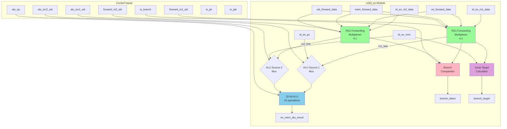

# RV32I Execute (EX) Stage Specification

**Module Name:** `rv32i_ex`  
**File:** `rtl/cpu/rv32i_ex.sv`  
**Version:** 1.0  
**Date:** January 4, 2026  
**Assertion Module:** `sim/assertions/rv32i_ex_timing_spec.sv`

---

## Table of Contents

1. [Overview](#overview)
2. [Block Diagram](#block-diagram)
3. [Interface Signals](#interface-signals)
4. [Functional Description](#functional-description)
5. [Timing Diagrams](#timing-diagrams)
6. [Verification Points](#verification-points)
7. [References](#references)

---

## Overview

The Execute (EX) stage is responsible for performing ALU operations, evaluating branch conditions, calculating jump targets, and selecting forwarded operands. It represents the third stage of the 5-stage RV32I pipeline.

### Responsibilities

1. **ALU Operations:** 32-bit arithmetic and logical operations
2. **Branch Condition Evaluation:** Compare operands for conditional branches
3. **Jump Target Calculation:** Compute target addresses for JAL/JALR
4. **Operand Forwarding:** Select forwarded values from later stages
5. **Branch/Jump Notification:** Signal IF stage for PC redirection

### Key Features

- **10 ALU Operations:** ADD, SUB, AND, OR, XOR, SLL, SRL, SRA, SLT, SLTU
- **6 Branch Comparisons:** EQ, NE, LT, GE, LTU, GEU
- **4-Way Forwarding Multiplexers:** ID/EX → EX/MEM → MEM/WB → WB paths
- **Zero-Latency Forwarding:** Pre-computed control from ID stage
- **PC-Relative Addressing:** Support for AUIPC and branches

---

## Block Diagram



---

## Interface Signals

### Input Signals

| Signal | Width | Source | Description |
|--------|-------|--------|-------------|
| `clk` | 1 | System | System clock |
| `rst_n` | 1 | System | Active-low reset |
| **ID/EX Pipeline Register** ||||
| `id_ex_valid` | 1 | rv32i_id | Instruction valid |
| `id_ex_pc` | 32 | rv32i_id | Program Counter |
| `id_ex_insn` | 32 | rv32i_id | Instruction (for debug) |
| `id_ex_rs1_data` | 32 | rv32i_id | Register rs1 value |
| `id_ex_rs2_data` | 32 | rv32i_id | Register rs2 value |
| `id_ex_imm` | 32 | rv32i_id | Immediate value |
| `id_ex_csr_rdata` | 32 | rv32i_id | CSR read value |
| `id_ex_ctrl` | struct | rv32i_id | Control signals |
| **Forwarding Control (from Hazard Unit)** ||||
| `forward_rs1_sel` | 2 | rv32i_hazard | RS1 forwarding select<br/>00=ID, 01=EX, 10=MEM, 11=WB |
| `forward_rs2_sel` | 2 | rv32i_hazard | RS2 forwarding select |
| **Forwarding Data Inputs** ||||
| `ex_forward_data` | 32 | EX/MEM reg | ALU result from EX/MEM |
| `mem_forward_data` | 32 | MEM/WB reg | Result from MEM/WB |
| `wb_forward_data` | 32 | rv32i_wb | Final writeback value |
| **Control from Hazard Unit** ||||
| `ex_flush` | 1 | rv32i_hazard | Flush EX stage (clear valid) |

### Output Signals

| Signal | Width | Destination | Description |
|--------|-------|-------------|-------------|
| **Branch/Jump Control** ||||
| `branch_taken` | 1 | rv32i_if, rv32i_hazard | Branch/jump condition met |
| `branch_target` | 32 | rv32i_if | Target PC for branch/jump |
| **EX/MEM Pipeline Register** ||||
| `ex_mem_valid` | 1 | rv32i_mem | Instruction valid |
| `ex_mem_pc` | 32 | rv32i_mem | Program Counter |
| `ex_mem_insn` | 32 | rv32i_mem | Instruction (for debug) |
| `ex_mem_alu_result` | 32 | rv32i_mem | ALU computation result |
| `ex_mem_rs2_data` | 32 | rv32i_mem | RS2 value (for stores) |
| `ex_mem_ctrl` | struct | rv32i_mem | Control signals for MEM/WB |

---

## Functional Description

### 4.1 Forwarding Multiplexers

**Purpose:** Select most recent value for operands when data hazards exist.

```systemverilog
logic [31:0] rs1_fwd, rs2_fwd;

// RS1 forwarding (4-way mux)
always_comb begin
    case (forward_rs1_sel)
        2'b00: rs1_fwd = id_ex_rs1_data;   // From ID stage (no hazard)
        2'b01: rs1_fwd = ex_forward_data;   // From EX/MEM register
        2'b10: rs1_fwd = mem_forward_data;  // From MEM/WB register
        2'b11: rs1_fwd = wb_forward_data;   // From WB stage
    endcase
end

// RS2 forwarding (identical pattern)
always_comb begin
    case (forward_rs2_sel)
        2'b00: rs2_fwd = id_ex_rs2_data;
        2'b01: rs2_fwd = ex_forward_data;
        2'b10: rs2_fwd = mem_forward_data;
        2'b11: rs2_fwd = wb_forward_data;
    endcase
end
```

**Forwarding Priority:** EX > MEM > WB > ID (most recent wins)

**Critical Path:** Forwarding muxes on ALU input (timing-sensitive)

---

### 4.2 ALU Source Multiplexers

**Purpose:** Select operands for ALU (register vs. immediate, PC vs. register).

```systemverilog
logic [31:0] alu_src1, alu_src2;

// ALU Source 1: rs1 or PC
always_comb begin
    if (id_ex_ctrl.alu_src1_sel)
        alu_src1 = id_ex_pc;        // For AUIPC
    else
        alu_src1 = rs1_fwd;         // Normal register operand
end

// ALU Source 2: rs2 or immediate
always_comb begin
    if (id_ex_ctrl.alu_src2_sel)
        alu_src2 = id_ex_imm;       // For I-type, stores, branches
    else
        alu_src2 = rs2_fwd;         // For R-type
end
```

---

### 4.3 32-bit ALU

**Operations:**

| alu_op | Operation | Description |
|--------|-----------|-------------|
| 4'b0000 | ADD | `result = A + B` |
| 4'b0001 | SUB | `result = A - B` |
| 4'b0010 | SLL | `result = A << B[4:0]` (logical left shift) |
| 4'b0011 | SLT | `result = (A < B) ? 1 : 0` (signed) |
| 4'b0100 | SLTU | `result = (A < B) ? 1 : 0` (unsigned) |
| 4'b0101 | XOR | `result = A ^ B` |
| 4'b0110 | SRL | `result = A >> B[4:0]` (logical right shift) |
| 4'b0111 | SRA | `result = A >>> B[4:0]` (arithmetic right shift) |
| 4'b1000 | OR | `result = A | B` |
| 4'b1001 | AND | `result = A & B` |
| 4'b1010 | PASS_B | `result = B` (for LUI) |

**Implementation:**

```systemverilog
logic [31:0] alu_result;

always_comb begin
    case (id_ex_ctrl.alu_op)
        4'b0000: alu_result = alu_src1 + alu_src2;               // ADD
        4'b0001: alu_result = alu_src1 - alu_src2;               // SUB
        4'b0010: alu_result = alu_src1 << alu_src2[4:0];         // SLL
        4'b0011: alu_result = ($signed(alu_src1) < $signed(alu_src2)) ? 32'h1 : 32'h0;  // SLT
        4'b0100: alu_result = (alu_src1 < alu_src2) ? 32'h1 : 32'h0;                    // SLTU
        4'b0101: alu_result = alu_src1 ^ alu_src2;               // XOR
        4'b0110: alu_result = alu_src1 >> alu_src2[4:0];         // SRL
        4'b0111: alu_result = $signed(alu_src1) >>> alu_src2[4:0]; // SRA
        4'b1000: alu_result = alu_src1 | alu_src2;               // OR
        4'b1001: alu_result = alu_src1 & alu_src2;               // AND
        4'b1010: alu_result = alu_src2;                          // PASS_B (LUI)
        default: alu_result = 32'h0;
    endcase
end
```

**Flags:** No architectural flags (overflow, carry, zero) - results evaluated in software.

---

### 4.4 Branch Comparator

**Purpose:** Evaluate branch conditions for BEQ, BNE, BLT, BGE, BLTU, BGEU.

```systemverilog
logic branch_condition_met;

always_comb begin
    case (id_ex_ctrl.funct3)  // funct3 encodes branch type
        3'b000: branch_condition_met = (rs1_fwd == rs2_fwd);                      // BEQ
        3'b001: branch_condition_met = (rs1_fwd != rs2_fwd);                      // BNE
        3'b100: branch_condition_met = ($signed(rs1_fwd) < $signed(rs2_fwd));    // BLT
        3'b101: branch_condition_met = ($signed(rs1_fwd) >= $signed(rs2_fwd));   // BGE
        3'b110: branch_condition_met = (rs1_fwd < rs2_fwd);                       // BLTU
        3'b111: branch_condition_met = (rs1_fwd >= rs2_fwd);                      // BGEU
        default: branch_condition_met = 1'b0;
    endcase
end

// Branch taken signal
assign branch_taken = id_ex_valid && (
    (id_ex_ctrl.is_branch && branch_condition_met) ||  // Conditional branch taken
    id_ex_ctrl.is_jal ||                                 // Unconditional jump (JAL)
    id_ex_ctrl.is_jalr                                   // Unconditional jump (JALR)
);
```

---

### 4.5 Jump Target Calculator

**Purpose:** Compute target PC for branches and jumps.

```systemverilog
logic [31:0] branch_target;

always_comb begin
    if (id_ex_ctrl.is_jalr) begin
        // JALR: target = (rs1 + imm) & ~1 (clear LSB for alignment)
        branch_target = (rs1_fwd + id_ex_imm) & 32'hFFFF_FFFE;
    end else begin
        // JAL, branches: target = PC + imm (PC-relative)
        branch_target = id_ex_pc + id_ex_imm;
    end
end
```

**Alignment:**
- **JALR:** LSB cleared to enforce 2-byte alignment (for compressed extension compatibility)
- **JAL/Branch:** Immediate already even (LSB = 0 by encoding)

---

### 4.6 EX/MEM Pipeline Register

```systemverilog
always_ff @(posedge clk or negedge rst_n) begin
    if (!rst_n) begin
        ex_mem_valid      <= 1'b0;
        ex_mem_pc         <= 32'h0;
        ex_mem_insn       <= 32'h0000_0013;  // NOP
        ex_mem_alu_result <= 32'h0;
        ex_mem_rs2_data   <= 32'h0;
        ex_mem_ctrl       <= '0;
    end else if (ex_flush) begin
        ex_mem_valid <= 1'b0;
        // Other fields can be don't-care
    end else begin
        ex_mem_valid      <= id_ex_valid;
        ex_mem_pc         <= id_ex_pc;
        ex_mem_insn       <= id_ex_insn;
        ex_mem_alu_result <= alu_result;
        ex_mem_rs2_data   <= rs2_fwd;  // Forwarded RS2 for stores
        ex_mem_ctrl       <= id_ex_ctrl;
    end
end
```

**Key Point:** `rs2_fwd` forwarded for store instructions (data to write to memory).

---

## Timing Diagrams

### 5.1 Normal ALU Operation (ADD)

```
Clock    : ___/‾‾‾\___/‾‾‾\___/‾‾‾\___
           
Cycle    :    N   | N+1   | N+2
           
id_ex_   : ADD    | SUB   | OR
insn     : x3,x1,x2|
           
rs1_fwd  : 0x0010 | ...   | ...
rs2_fwd  : 0x0020 | ...   | ...
           
alu_op   : ADD    | SUB   | OR
           : (0000)|
           
alu_     : 0x0030 | ...   | ...
result   : (0x10+0x20)
           
ex_mem_  : ...    | 0x0030| ...
alu_     :        | (reg) |
result   :        |        |
```

**Description:** ALU computes result combinationally, registered in EX/MEM.

---

### 5.2 EX-to-EX Forwarding

```
Clock    : ___/‾‾‾\___/‾‾‾\___/‾‾‾\___/‾‾‾\___
           
Cycle    :    0   |   1   |   2   |   3
           
IF:      : ADD1  | ADD2  | ADD3  | ...
ID:      : NOP   | ADD1  | ADD2  | ADD3
EX:      : ...   | NOP   | ADD1  | ADD2
MEM:     : ...   | ...   | NOP   | ADD1
           
ADD1: x1 = x2 + x3         Result: 0xAAAA
ADD2: x4 = x1 + x5         Uses x1 (hazard!)
           
forward_ : 00    | 00    | 01    | 01
rs1_sel  :        |        | (EX fwd)
           
rs1_fwd  : ...   | ...   | 0xAAAA| ...
           :        |        | (forwarded from EX/MEM)
           
alu_     : ...   | ...   | 0xAAAA| ...
result   :        |        | + x5  |
```

**Description:** ADD2 receives ADD1 result via EX→EX forwarding path.

---

### 5.3 Branch Taken

```
Clock    : ___/‾‾‾\___/‾‾‾\___/‾‾‾\___/‾‾‾\___
           
Cycle    :    0   |   1   |   2   |   3
           
IF:      : BEQ   | ADD   | SUB   | TGT
ID:      : NOP   | BEQ   | ADD   | BUBBLE
EX:      : ...   | NOP   | BEQ   | BUBBLE
           :        |        | (cmp)|
           
rs1_fwd  : ...   | ...   | 0x0010| ...
rs2_fwd  : ...   | ...   | 0x0010| ...
           
branch_  : ...   | ...   | EQ=1  | ...
condition:        |        | (match)
           
branch_  : 0     | 0     | 1     | 0
taken    :        |        | (assert)
           
branch_  : ...   | ...   | 0x0100| ...
target   :        |        | (PC+imm)
```

**Description:** Branch condition evaluated in EX, PC redirected next cycle.

---

### 5.4 JALR Target Calculation

```
Clock    : ___/‾‾‾\___/‾‾‾\___/‾‾‾\___
           
Cycle    :    N   | N+1   | N+2
           
id_ex_   : JALR  | ...   | ...
insn     : x1,4(x2)|
           
rs1_fwd  : 0x1000| ...   | ...
id_ex_imm: 0x0004| ...   | ...
           
branch_  : 0x1004| ...   | ...
target   : (0x1000+0x4)
           : & ~1  |
           
branch_  : 1     | 0     | 0
taken    : (JALR)|
```

**Description:** JALR target = (rs1 + imm) with LSB cleared.

---

## Verification Points

### 5.1 Assertion Checklist

The following properties are verified by `rv32i_ex_timing_spec.sv`:

#### **SPEC-EX-1: ALU ADD Operation**
```systemverilog
property alu_add_correct;
    logic [31:0] op1, op2;
    @(posedge clk) disable iff (!rst_n)
    (id_ex_valid && id_ex_ctrl.alu_op == 4'b0000, 
     op1 = alu_src1, op2 = alu_src2)
    ##1 (ex_mem_alu_result == (op1 + op2));
endproperty
```

#### **SPEC-EX-2: BEQ Branch Condition**
```systemverilog
property beq_branch_taken;
    @(posedge clk) disable iff (!rst_n)
    (id_ex_valid && id_ex_ctrl.is_branch && 
     id_ex_ctrl.funct3 == 3'b000 && (rs1_fwd == rs2_fwd))
    |-> branch_taken;
endproperty
```

#### **SPEC-EX-3: Forwarding Mux Selection (EX Priority)**
```systemverilog
property ex_forward_priority;
    logic [31:0] fwd_data;
    @(posedge clk) disable iff (!rst_n)
    (forward_rs1_sel == 2'b01, fwd_data = ex_forward_data)
    |-> (rs1_fwd == fwd_data);
endproperty
```

#### **SPEC-EX-4: JALR Target Alignment**
```systemverilog
property jalr_target_aligned;
    @(posedge clk) disable iff (!rst_n)
    (id_ex_valid && id_ex_ctrl.is_jalr)
    |-> (branch_target[0] == 1'b0);  // LSB always zero
endproperty
```

#### **SPEC-EX-5: Branch Target PC-Relative**
```systemverilog
property branch_target_pc_relative;
    logic [31:0] pc, imm;
    @(posedge clk) disable iff (!rst_n)
    (id_ex_valid && id_ex_ctrl.is_branch && branch_taken,
     pc = id_ex_pc, imm = id_ex_imm)
    |-> (branch_target == (pc + imm));
endproperty
```

#### **SPEC-EX-6: Flush Clears Valid**
```systemverilog
property ex_flush_clears_valid;
    @(posedge clk) disable iff (!rst_n)
    ex_flush |=> (ex_mem_valid == 1'b0);
endproperty
```

---

### 5.2 Coverage Goals

1. **ALU Operation Coverage:** All 10 ALU ops exercised
2. **Branch Condition Coverage:** All 6 branch types (taken/not-taken)
3. **Forwarding Path Coverage:**
   - RS1: ID/EX/MEM/WB sources
   - RS2: ID/EX/MEM/WB sources
4. **Edge Cases:**
   - ALU overflow (add/sub)
   - Shift by 31 (maximum)
   - SLT with equal values
   - Branch to same address (infinite loop)

---

## References

### Related Documents
- **[rv32i_modular_architecture_spec.md](../../docs/rv32i_modular_architecture_spec.md)** - Overall architecture
- **[rv32i_pipeline_interfaces.md](../../docs/rv32i_pipeline_interfaces.md)** - Pipeline register structures
- **[rv32i_hazard_spec.md](rv32i_hazard_spec.md)** - Hazard unit (forwarding control)
- **[rv32i_id_spec.md](rv32i_id_spec.md)** - ID stage (provides operands)
- **[rv32i_mem_spec.md](rv32i_mem_spec.md)** - MEM stage (receives ALU result)

### Assertion Modules
- **[rv32i_ex_timing_spec.sv](../../sim/assertions/rv32i_ex_timing_spec.sv)** - EX stage timing assertions
- **[bind_rv32i_ex_spec.sv](../../sim/assertions/bind_rv32i_ex_spec.sv)** - Assertion binding file

### Test Cases
- **rv32i_basic_test.sv** - All ALU and branch operations
- **alu_exhaustive_test.sv** - ALU corner cases (TBD)
- **branch_coverage_test.sv** - All branch conditions (TBD)

---

**Specification Version:** 1.0  
**Last Updated:** 2026-01-04  
**Status:** Design Phase - Pre-Implementation
