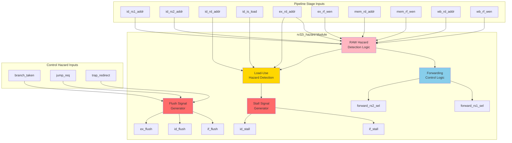
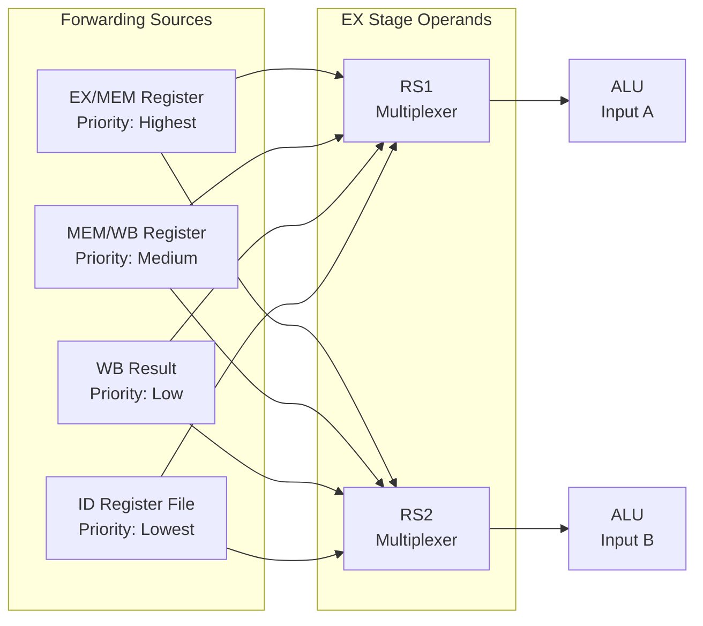
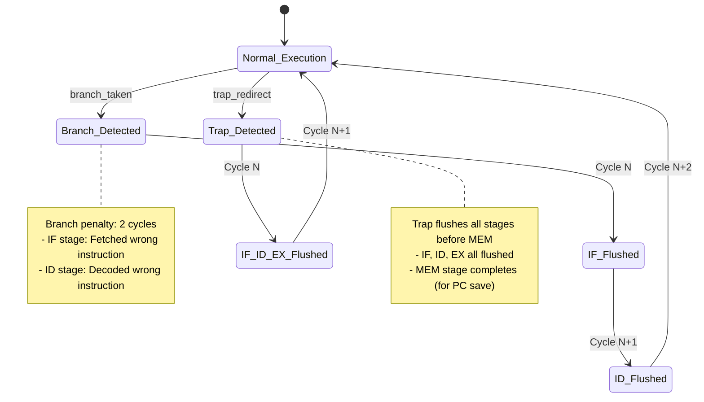

# RV32I Hazard Detection and Control Unit Specification

**Module Name:** `rv32i_hazard`  
**File:** `rtl/cpu/rv32i_hazard.sv`  
**Version:** 1.0  
**Date:** January 4, 2026  
**Assertion Module:** `sim/assertions/rv32i_hazard_timing_spec.sv`

---

## Table of Contents

1. [Overview](#overview)
2. [Block Diagram](#block-diagram)
3. [Interface Signals](#interface-signals)
4. [Functional Description](#functional-description)
5. [Timing Diagrams](#timing-diagrams)
6. [Verification Points](#verification-points)
7. [References](#references)

---

## Overview

The Hazard Detection and Control Unit is responsible for detecting data hazards (RAW), structural hazards (load-use), and control hazards (branch/jump), and generating appropriate stall, flush, and forwarding control signals to maintain pipeline correctness.

### Responsibilities

1. **RAW Hazard Detection:** Identify Read-After-Write dependencies between pipeline stages
2. **Forwarding Control:** Generate multiplexer select signals for EX-stage forwarding
3. **Load-Use Stall:** Detect and stall pipeline when load result needed immediately
4. **Control Hazard Handling:** Generate flush signals for branch/jump misprediction
5. **Exception Flush:** Propagate flush on trap/MRET

### Key Features

- **3-Source Forwarding:** EX→EX, MEM→EX, WB→EX paths
- **Priority-Based Selection:** EX > MEM > WB forwarding priority
- **Pre-Computed Control:** Forwarding decisions made in ID stage, registered in ID/EX
- **1-Cycle Load-Use Stall:** Minimal penalty for load-to-use dependencies
- **2-Cycle Branch Penalty:** Stall + flush on branch taken

---

## Block Diagram



---

## Interface Signals

### Input Signals

| Signal | Width | Source | Description |
|--------|-------|--------|-------------|
| `clk` | 1 | System | System clock |
| `rst_n` | 1 | System | Active-low reset |
| **ID Stage** ||||
| `id_valid` | 1 | rv32i_id | ID stage instruction valid |
| `id_rs1_addr` | 5 | rv32i_id | Source register 1 address |
| `id_rs2_addr` | 5 | rv32i_id | Source register 2 address |
| `id_rd_addr` | 5 | rv32i_id | Destination register address |
| `id_rf_wen` | 1 | rv32i_id | ID stage will write register file |
| `id_is_load` | 1 | rv32i_id | ID instruction is load (LB/LH/LW/LBU/LHU) |
| **EX Stage** ||||
| `ex_valid` | 1 | rv32i_ex | EX stage instruction valid |
| `ex_rd_addr` | 5 | rv32i_ex | EX destination register |
| `ex_rf_wen` | 1 | rv32i_ex | EX will write register file |
| **MEM Stage** ||||
| `mem_valid` | 1 | rv32i_mem | MEM stage instruction valid |
| `mem_rd_addr` | 5 | rv32i_mem | MEM destination register |
| `mem_rf_wen` | 1 | rv32i_mem | MEM will write register file |
| **WB Stage** ||||
| `wb_valid` | 1 | rv32i_wb | WB stage instruction valid |
| `wb_rd_addr` | 5 | rv32i_wb | WB destination register |
| `wb_rf_wen` | 1 | rv32i_wb | WB writes register file |
| **Control Hazards** ||||
| `branch_taken` | 1 | rv32i_ex | Branch/jump taken in EX |
| `jump_req` | 1 | rv32i_ex | Unconditional jump (JAL/JALR) |
| `trap_redirect` | 1 | rv32i_csr | Exception trap redirect |
| `mret_req` | 1 | rv32i_mem | MRET instruction in MEM |

### Output Signals

| Signal | Width | Destination | Description |
|--------|-------|-------------|-------------|
| **Stall Signals** ||||
| `if_stall` | 1 | rv32i_if | Stall IF stage (freeze PC) |
| `id_stall` | 1 | rv32i_id | Stall ID stage (hold decode) |
| **Flush Signals** ||||
| `if_flush` | 1 | rv32i_if | Flush IF stage (inject bubble) |
| `id_flush` | 1 | rv32i_id | Flush ID stage (clear valid) |
| `ex_flush` | 1 | rv32i_ex | Flush EX stage (clear valid) |
| **Forwarding Control** ||||
| `forward_rs1_sel` | 2 | rv32i_ex | RS1 forwarding mux select<br/>00=ID, 01=EX, 10=MEM, 11=WB |
| `forward_rs2_sel` | 2 | rv32i_ex | RS2 forwarding mux select |

---

## Functional Description

### 4.1 RAW Hazard Detection

**Read-After-Write (RAW) Hazard:** Instruction in ID stage reads register that previous instruction writes.

```systemverilog
// RAW hazard for RS1
logic raw_rs1_ex, raw_rs1_mem, raw_rs1_wb;

assign raw_rs1_ex = (id_rs1_addr != 5'b0) &&        // Not x0
                    (id_rs1_addr == ex_rd_addr) &&   // Address match
                    ex_rf_wen &&                     // EX writes RF
                    ex_valid;                        // EX instruction valid

assign raw_rs1_mem = (id_rs1_addr != 5'b0) &&
                     (id_rs1_addr == mem_rd_addr) &&
                     mem_rf_wen &&
                     mem_valid;

assign raw_rs1_wb = (id_rs1_addr != 5'b0) &&
                    (id_rs1_addr == wb_rd_addr) &&
                    wb_rf_wen &&
                    wb_valid;

// Same logic for RS2
logic raw_rs2_ex, raw_rs2_mem, raw_rs2_wb;
// ... (identical pattern)
```

**Key Rules:**
1. **x0 Exclusion:** Register x0 always reads as zero, never causes hazard
2. **Valid Check:** Only consider hazards from valid instructions
3. **Write Enable:** Only instructions that write registers cause hazards

---

### 4.2 Forwarding Control Logic

```systemverilog
// Forwarding priority: EX > MEM > WB > ID (no forward)
always_comb begin
    // RS1 forwarding
    if (raw_rs1_ex)
        forward_rs1_sel = 2'b01;      // Forward from EX/MEM register
    else if (raw_rs1_mem)
        forward_rs1_sel = 2'b10;      // Forward from MEM/WB register
    else if (raw_rs1_wb)
        forward_rs1_sel = 2'b11;      // Forward from WB result
    else
        forward_rs1_sel = 2'b00;      // Use ID stage register read
    
    // RS2 forwarding (same logic)
    if (raw_rs2_ex)
        forward_rs2_sel = 2'b01;
    else if (raw_rs2_mem)
        forward_rs2_sel = 2'b10;
    else if (raw_rs2_wb)
        forward_rs2_sel = 2'b11;
    else
        forward_rs2_sel = 2'b00;
end
```

**Forwarding Paths:**



---

### 4.3 Load-Use Hazard Detection

**Load-Use Hazard:** Instruction in ID stage needs result of load currently in EX stage.

```systemverilog
logic load_use_hazard;

assign load_use_hazard = ex_valid &&           // EX instruction valid
                         ex_is_load &&          // EX is load instruction
                         ex_rf_wen &&           // EX writes register
                         ((ex_rd_addr == id_rs1_addr && id_rs1_addr != 5'b0) ||
                          (ex_rd_addr == id_rs2_addr && id_rs2_addr != 5'b0));
```

**Stall Generation:**
```systemverilog
assign if_stall = load_use_hazard;
assign id_stall = load_use_hazard;
```

**Behavior:**
- **Cycle N:** Load instruction in EX stage
- **Cycle N+1:** Dependent instruction in ID stage → **STALL**
- **Cycle N+2:** Load completes to MEM stage → **FORWARD**

**Timing:**
```
Cycle:    0   |   1   |   2   |   3   |   4
          
IF:     LW    | ADD   | ADD   | SUB   | ...
ID:     NOP   | LW    | ADD   | ADD   | SUB
EX:     ...   | NOP   | LW    | BUBBLE| ADD
MEM:    ...   | ...   | NOP   | LW    | BUBBLE
WB:     ...   | ...   | ...   | NOP   | LW

Hazard: ----- | ----- | STALL | FWD   | -----
        
LW x1, 0(x2)           Load x1
ADD x3, x1, x4         Uses x1 (hazard!)
```

**Why Not Forward from EX?**
- Load data not available until MEM stage (memory read latency)
- EX/MEM register contains address, not data
- Must wait 1 cycle for memory access to complete

---

### 4.4 Control Hazard Handling

**Branch/Jump Flush:**

```systemverilog
// Flush IF and ID stages when branch taken
assign if_flush = branch_taken | jump_req | trap_redirect | mret_req;
assign id_flush = branch_taken | jump_req | trap_redirect | mret_req;
assign ex_flush = trap_redirect | mret_req;  // Only trap flushes EX
```

**Flush Propagation:**



**Flush Timing:**
```
Cycle:    0   |   1   |   2   |   3   |   4
          
IF:     BEQ   | ADD   | SUB   | TGT   | ...
ID:     ...   | BEQ   | ADD   | BUBBLE| TGT
EX:     ...   | ...   | BEQ   | BUBBLE| BUBBLE
MEM:    ...   | ...   | ...   | BEQ   | BUBBLE
WB:     ...   | ...   | ...   | ...   | BEQ

Branch: ----- | ----- | TAKEN | ----- | -----
Flush:  ----- | ----- | IF+ID | ----- | -----
```

---

### 4.5 Pre-Computed Forwarding Optimization

**Standard Approach (Reference Design):**
```
ID Stage: Register Read
  ↓
EX Stage: Hazard Detection → Forwarding Mux → ALU
          \_______ Critical Path _______/
```

**Optimized Approach (Current Design):**
```
ID Stage: Register Read + Hazard Detection
  ↓ (Registered)
EX Stage: Forwarding Mux → ALU
          \_ Shorter Path _/
```

**Implementation:**
```systemverilog
// In rv32i_hazard module (combinational)
assign forward_rs1_sel = ...;  // Computed in ID stage
assign forward_rs2_sel = ...;

// In ID/EX pipeline register
always_ff @(posedge clk) begin
    if (!id_stall) begin
        id_ex_forward_rs1 <= forward_rs1_sel;  // Register control signals
        id_ex_forward_rs2 <= forward_rs2_sel;
    end
end

// In rv32i_ex module (use registered controls)
always_comb begin
    case (id_ex_forward_rs1)
        2'b00: rs1_fwd = id_ex_rs1_data;     // From ID
        2'b01: rs1_fwd = ex_mem_alu_result;  // From EX/MEM
        2'b10: rs1_fwd = mem_wb_result;      // From MEM/WB
        2'b11: rs1_fwd = wb_result;          // From WB
    endcase
end
```

**Benefit:** Removes hazard detection logic from ALU critical path, improves Fmax.

---

## Timing Diagrams

### 5.1 EX-to-EX Forwarding (No Stall)

```
Cycle:    0   |   1   |   2   |   3   |   4
          
IF:     ADD   | SUB   | OR    | ...   | ...
ID:     NOP   | ADD   | SUB   | OR    | ...
EX:     ...   | NOP   | ADD   | SUB   | OR
MEM:    ...   | ...   | NOP   | ADD   | SUB
WB:     ...   | ...   | ...   | NOP   | ADD

ADD x1, x2, x3         x1 = x2 + x3
SUB x4, x1, x5         Uses x1 (RAW hazard)

Hazard: ----- | ----- | RAW   | ----- | -----
Fwd:    ----- | ----- | EX→EX | ----- | -----
Stall:  ----- | ----- | NO    | ----- | -----
```

**Forwarding Control (Cycle 2):**
- `forward_rs1_sel = 2'b01` (forward from EX/MEM register)
- SUB receives ADD result before MEM stage
- No stall required

---

### 5.2 Load-Use Hazard (1-Cycle Stall)

```
Cycle:    0   |   1   |   2   |   3   |   4
          
IF:     LW    | ADD   | ADD   | SUB   | ...
ID:     NOP   | LW    | ADD   | ADD   | SUB
EX:     ...   | NOP   | LW    | BUBBLE| ADD
MEM:    ...   | ...   | NOP   | LW    | BUBBLE
WB:     ...   | ...   | ...   | NOP   | LW

LW x1, 0(x2)           Load x1
ADD x3, x1, x4         Uses x1 (load-use hazard)

Hazard: ----- | ----- | L-U   | RAW   | -----
Stall:  ----- | ----- | YES   | NO    | -----
Fwd:    ----- | ----- | N/A   | MEM→EX| -----
```

**Behavior:**
- **Cycle 2:** Load-use detected, IF/ID stalled
- **Cycle 3:** Load data available in MEM/WB, forward to ADD in EX
- **Penalty:** 1 cycle

---

### 5.3 Branch Taken (2-Cycle Penalty)

```
Cycle:    0   |   1   |   2   |   3   |   4   |   5
          
IF:     BEQ   | ADD   | SUB   | TGT   | ...   | ...
ID:     NOP   | BEQ   | ADD   | BUBBLE| TGT   | ...
EX:     ...   | NOP   | BEQ   | BUBBLE| BUBBLE| TGT
MEM:    ...   | ...   | NOP   | BEQ   | BUBBLE| BUBBLE
WB:     ...   | ...   | ...   | NOP   | BEQ   | BUBBLE

BEQ x1, x2, target     Branch to target
ADD x3, x4, x5         (Wrong path)
SUB x6, x7, x8         (Wrong path)

Branch: ----- | ----- | TAKEN | ----- | ----- | -----
Flush:  ----- | ----- | IF+ID | ----- | ----- | -----
```

**Behavior:**
- **Cycle 2:** Branch condition evaluated in EX → TAKEN
- **Cycle 2:** IF and ID stages flushed (bubbles injected)
- **Cycle 3:** Correct target instruction fetched
- **Penalty:** 2 cycles (2 instructions flushed)

---

### 5.4 Back-to-Back Forwarding

```
Cycle:    0   |   1   |   2   |   3   |   4
          
IF:     ADD1  | ADD2  | ADD3  | ...   | ...
ID:     NOP   | ADD1  | ADD2  | ADD3  | ...
EX:     ...   | NOP   | ADD1  | ADD2  | ADD3
MEM:    ...   | ...   | NOP   | ADD1  | ADD2
WB:     ...   | ...   | ...   | NOP   | ADD1

ADD x1, x2, x3         x1 = x2 + x3
ADD x1, x1, x4         x1 = x1 + x4 (uses previous x1)
ADD x1, x1, x5         x1 = x1 + x5 (uses previous x1)

Hazard: ----- | ----- | EX→EX | EX→EX | EX→EX
Fwd:    ----- | ----- | YES   | YES   | YES
Stall:  ----- | ----- | NO    | NO    | NO
```

**Description:** Forwarding chain supports back-to-back dependencies without stalls.

---

## Verification Points

### 6.1 Assertion Checklist

The following properties are verified by `rv32i_hazard_timing_spec.sv`:

#### **SPEC-HAZ-1: RAW Hazard Detection**
```systemverilog
// RAW hazard correctly identified
property raw_hazard_ex_rs1;
    @(posedge clk) disable iff (!rst_n)
    (id_valid && ex_valid && ex_rf_wen && 
     (id_rs1_addr == ex_rd_addr) && (id_rs1_addr != 5'b0))
    |-> (forward_rs1_sel == 2'b01);
endproperty
```

#### **SPEC-HAZ-2: Forwarding Priority**
```systemverilog
// EX forwarding has higher priority than MEM
property forward_priority_ex_over_mem;
    @(posedge clk) disable iff (!rst_n)
    (ex_valid && ex_rf_wen && (ex_rd_addr == id_rs1_addr) &&
     mem_valid && mem_rf_wen && (mem_rd_addr == id_rs1_addr) &&
     (id_rs1_addr != 5'b0))
    |-> (forward_rs1_sel == 2'b01);  // EX priority
endproperty
```

#### **SPEC-HAZ-3: Load-Use Stall**
```systemverilog
// Load-use hazard triggers stall
property load_use_stall_if;
    @(posedge clk) disable iff (!rst_n)
    (ex_valid && ex_is_load && ex_rf_wen &&
     ((ex_rd_addr == id_rs1_addr && id_rs1_addr != 5'b0) ||
      (ex_rd_addr == id_rs2_addr && id_rs2_addr != 5'b0)))
    |-> (if_stall && id_stall);
endproperty
```

#### **SPEC-HAZ-4: Branch Flush**
```systemverilog
// Branch taken flushes IF and ID
property branch_flush_propagation;
    @(posedge clk) disable iff (!rst_n)
    branch_taken |-> (if_flush && id_flush);
endproperty
```

#### **SPEC-HAZ-5: x0 Never Causes Hazard**
```systemverilog
// Reading x0 never triggers forwarding
property x0_no_forward_rs1;
    @(posedge clk) disable iff (!rst_n)
    (id_rs1_addr == 5'b0) |-> (forward_rs1_sel == 2'b00);
endproperty
```

#### **SPEC-HAZ-6: Stall Clears on Resolution**
```systemverilog
// Load-use stall clears after 1 cycle
property load_use_stall_clears;
    @(posedge clk) disable iff (!rst_n)
    (load_use_hazard ##1 !load_use_hazard)
    |-> ##1 (!if_stall && !id_stall);
endproperty
```

---

### 6.2 Coverage Goals

1. **Forwarding Path Coverage:**
   - EX→EX forwarding (rs1, rs2)
   - MEM→EX forwarding (rs1, rs2)
   - WB→EX forwarding (rs1, rs2)
   - No forwarding (baseline)

2. **Hazard Combination Coverage:**
   - RAW hazard only
   - Load-use hazard only
   - RAW + load-use simultaneously
   - Control hazard + data hazard

3. **Priority Coverage:**
   - EX vs MEM forwarding conflict (EX wins)
   - MEM vs WB forwarding conflict (MEM wins)
   - Triple conflict (EX > MEM > WB)

4. **Edge Cases:**
   - Back-to-back load-use hazards
   - Flush during stall
   - x0 register dependency (no hazard)
   - Disabled destination (rf_wen=0, no hazard)

---

## References

### Related Documents
- **[rv32i_modular_architecture_spec.md](../../docs/rv32i_modular_architecture_spec.md)** - Overall architecture
- **[rv32i_pipeline_interfaces.md](../../docs/rv32i_pipeline_interfaces.md)** - Pipeline register structures
- **[rv32i_id_spec.md](rv32i_id_spec.md)** - ID stage (registers source addresses)
- **[rv32i_ex_spec.md](rv32i_ex_spec.md)** - EX stage (uses forwarding controls)

### Assertion Modules
- **[rv32i_hazard_timing_spec.sv](../../sim/assertions/rv32i_hazard_timing_spec.sv)** - Hazard unit timing assertions
- **[rv32i_data_hazard_spec.sv](../../sim/assertions/rv32i_data_hazard_spec.sv)** - Existing data hazard assertions
- **[bind_rv32i_hazard_spec.sv](../../sim/assertions/bind_rv32i_hazard_spec.sv)** - Assertion binding file

### Test Cases
- **rv32i_basic_test.sv** - Exercises forwarding paths
- **data_hazard_stress_test.sv** - Back-to-back dependencies (TBD)
- **load_use_hazard_test.sv** - Load-use stall verification (TBD)

---

**Specification Version:** 1.0  
**Last Updated:** 2026-01-04  
**Status:** Design Phase - Pre-Implementation
