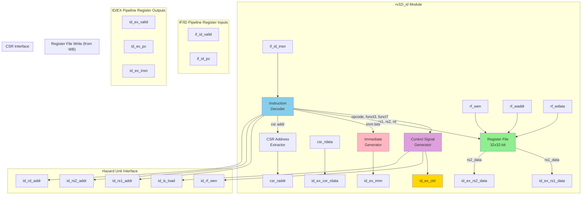
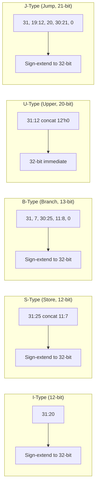

# RV32I Instruction Decode (ID) Stage Specification

**Module Name:** `rv32i_id`  
**File:** `rtl/cpu/rv32i_id.sv`  
**Version:** 1.0  
**Date:** January 4, 2026  
**Assertion Module:** `sim/assertions/rv32i_id_timing_spec.sv`

---

## Table of Contents

1. [Overview](#overview)
2. [Block Diagram](#block-diagram)
3. [Interface Signals](#interface-signals)
4. [Functional Description](#functional-description)
5. [Timing Diagrams](#timing-diagrams)
6. [Exception Conditions](#exception-conditions)
7. [Verification Points](#verification-points)
8. [References](#references)

---

## Overview

The Instruction Decode (ID) stage is responsible for decoding fetched instructions, reading operands from the register file, generating immediate values, and initiating CSR reads. It represents the second stage of the 5-stage RV32I pipeline.

### Responsibilities

1. **Instruction Decoding:** Extract opcode, funct3, funct7, and register addresses
2. **Register File Management:** 32×32-bit register file with combinational read, synchronous write
3. **Immediate Generation:** Extract and sign-extend immediate values (I/S/B/U/J types)
4. **Control Signal Generation:** Decode instruction to produce control signals for downstream stages
5. **CSR Read Initiation:** Request CSR read for CSRRW/CSRRS/CSRRC instructions
6. **Hazard Information:** Provide register addresses to hazard unit

### Key Features

- **40 RV32I Instructions:** Complete base integer ISA support
- **x0 Hardwire:** Register x0 always reads as zero (RISC-V compliance)
- **Illegal Instruction Detection:** Flag unsupported opcodes/encodings
- **Combinational Register Read:** Zero-latency operand access
- **5 Immediate Formats:** I-type, S-type, B-type, U-type, J-type

---

## Block Diagram



---

## Interface Signals

### Input Signals

| Signal | Width | Source | Description |
|--------|-------|--------|-------------|
| `clk` | 1 | System | System clock |
| `rst_n` | 1 | System | Active-low reset |
| **IF/ID Pipeline Register** ||||
| `if_id_valid` | 1 | rv32i_if | Instruction valid flag |
| `if_id_pc` | 32 | rv32i_if | Program Counter |
| `if_id_insn` | 32 | rv32i_if | Instruction word |
| **Control from Hazard Unit** ||||
| `id_stall` | 1 | rv32i_hazard | Stall ID stage (hold outputs) |
| `id_flush` | 1 | rv32i_hazard | Flush ID stage (inject bubble) |
| **Register File Write (from WB)** ||||
| `rf_wen` | 1 | rv32i_wb | Register file write enable |
| `rf_waddr` | 5 | rv32i_wb | Write address (destination register) |
| `rf_wdata` | 32 | rv32i_wb | Write data |
| **CSR Read Interface** ||||
| `csr_rdata` | 32 | rv32i_csr | CSR read data |

### Output Signals

| Signal | Width | Destination | Description |
|--------|-------|-------------|-------------|
| **CSR Read Request** ||||
| `csr_raddr` | 12 | rv32i_csr | CSR address for read |
| **Hazard Detection Interface** ||||
| `id_rs1_addr` | 5 | rv32i_hazard | Source register 1 address |
| `id_rs2_addr` | 5 | rv32i_hazard | Source register 2 address |
| `id_rd_addr` | 5 | rv32i_hazard | Destination register address |
| `id_rf_wen` | 1 | rv32i_hazard | Will write register file |
| `id_is_load` | 1 | rv32i_hazard | Is load instruction (for load-use detection) |
| **ID/EX Pipeline Register** ||||
| `id_ex_valid` | 1 | rv32i_ex | Instruction valid |
| `id_ex_pc` | 32 | rv32i_ex | Program Counter |
| `id_ex_insn` | 32 | rv32i_ex | Instruction word (for debug) |
| `id_ex_rs1_data` | 32 | rv32i_ex | Register rs1 value |
| `id_ex_rs2_data` | 32 | rv32i_ex | Register rs2 value |
| `id_ex_imm` | 32 | rv32i_ex | Immediate value (sign-extended) |
| `id_ex_csr_rdata` | 32 | rv32i_ex | CSR read value |
| `id_ex_ctrl` | struct | rv32i_ex | Control signals for EX/MEM/WB stages |

---

## Functional Description

### 4.1 Instruction Decoder

```systemverilog
// Extract instruction fields
logic [6:0]  opcode;
logic [4:0]  rd, rs1, rs2;
logic [2:0]  funct3;
logic [6:0]  funct7;
logic [11:0] imm_i, csr_addr;

assign opcode = if_id_insn[6:0];
assign rd     = if_id_insn[11:7];
assign funct3 = if_id_insn[14:12];
assign rs1    = if_id_insn[19:15];
assign rs2    = if_id_insn[24:20];
assign funct7 = if_id_insn[31:25];
assign imm_i  = if_id_insn[31:20];
assign csr_addr = if_id_insn[31:20];
```

**Opcode Classification:**

| Opcode [6:0] | Instruction Type | Format |
|--------------|------------------|--------|
| `7'b0110011` | R-type (ADD, SUB, AND, OR, XOR, SLL, SRL, SRA, SLT, SLTU) | R |
| `7'b0010011` | I-type ALU (ADDI, ANDI, ORI, XORI, SLLI, SRLI, SRAI, SLTI, SLTIU) | I |
| `7'b0000011` | Load (LB, LH, LW, LBU, LHU) | I |
| `7'b0100011` | Store (SB, SH, SW) | S |
| `7'b1100011` | Branch (BEQ, BNE, BLT, BGE, BLTU, BGEU) | B |
| `7'b1101111` | JAL (jump and link) | J |
| `7'b1100111` | JALR (jump and link register) | I |
| `7'b0110111` | LUI (load upper immediate) | U |
| `7'b0010111` | AUIPC (add upper immediate to PC) | U |
| `7'b1110011` | System (ECALL, EBREAK, CSRRW, CSRRS, CSRRC, MRET) | I |

---

### 4.2 Register File

**Architecture:**
- **32 registers:** x0-x31 (each 32 bits)
- **x0 hardwire:** Always reads as 0x00000000
- **Read ports:** 2 combinational read ports (rs1, rs2)
- **Write port:** 1 synchronous write port (posedge clk)

```systemverilog
// Register file storage (31 registers, x0 is hardwired)
logic [31:0] regfile [1:31];

// Combinational read (x0 returns zero)
assign rs1_data = (rs1 == 5'b0) ? 32'h0 : regfile[rs1];
assign rs2_data = (rs2 == 5'b0) ? 32'h0 : regfile[rs2];

// Synchronous write (x0 writes ignored)
always_ff @(posedge clk or negedge rst_n) begin
    if (!rst_n) begin
        // Optional: Initialize registers to zero
        for (int i = 1; i < 32; i++) begin
            regfile[i] <= 32'h0;
        end
    end else if (rf_wen && rf_waddr != 5'b0) begin
        regfile[rf_waddr] <= rf_wdata;
    end
end
```

**Key Behavior:**
- **x0 reads:** Always return 0, regardless of write attempts
- **Combinational read:** Zero latency from address to data
- **Write timing:** Data available in next cycle after `rf_wen` assertion
- **Read-during-write:** Uses old value (write occurs on clock edge)

---

### 4.3 Immediate Generation

**RV32I Immediate Formats:**



**Implementation:**

```systemverilog
logic [31:0] imm;

always_comb begin
    case (opcode)
        // I-type: ADDI, SLTI, SLTIU, ANDI, ORI, XORI, LB, LH, LW, LBU, LHU, JALR
        7'b0010011, 7'b0000011, 7'b1100111: begin
            imm = {{20{if_id_insn[31]}}, if_id_insn[31:20]};
        end
        
        // S-type: SB, SH, SW
        7'b0100011: begin
            imm = {{20{if_id_insn[31]}}, if_id_insn[31:25], if_id_insn[11:7]};
        end
        
        // B-type: BEQ, BNE, BLT, BGE, BLTU, BGEU
        7'b1100011: begin
            imm = {{19{if_id_insn[31]}}, if_id_insn[31], if_id_insn[7], 
                   if_id_insn[30:25], if_id_insn[11:8], 1'b0};
        end
        
        // U-type: LUI, AUIPC
        7'b0110111, 7'b0010111: begin
            imm = {if_id_insn[31:12], 12'h0};
        end
        
        // J-type: JAL
        7'b1101111: begin
            imm = {{11{if_id_insn[31]}}, if_id_insn[31], if_id_insn[19:12],
                   if_id_insn[20], if_id_insn[30:21], 1'b0};
        end
        
        // Default: zero (for R-type and invalid)
        default: imm = 32'h0;
    endcase
end
```

**Sign Extension Rules:**
- **I/S/B/J-type:** MSB (sign bit) replicated to fill upper bits
- **U-type:** No sign extension (20-bit value left-shifted by 12)
- **Branch/Jump offsets:** Always even (LSB = 0)

---

### 4.4 Control Signal Generation

```systemverilog
// Control signal structure (from rv32i_pipeline_pkg)
typedef struct packed {
    logic [3:0]  alu_op;        // ALU operation
    logic        alu_src1_sel;  // 0=rs1, 1=PC
    logic        alu_src2_sel;  // 0=rs2, 1=imm
    logic        is_branch;
    logic        is_jal;
    logic        is_jalr;
    logic        mem_read;
    logic        mem_write;
    logic [2:0]  mem_size;      // 000=byte, 001=half, 010=word
    logic        mem_unsigned;
    logic        rf_wen;
    logic [1:0]  rf_wdata_sel;  // 00=ALU, 01=mem, 10=PC+4, 11=CSR
    logic        is_csr;
    logic [1:0]  csr_op;
    logic        is_ebreak;
    logic        is_ecall;
    logic        is_mret;
    logic        is_illegal;
} ctrl_signals_t;

ctrl_signals_t ctrl;

always_comb begin
    // Default: all zeros (NOP behavior)
    ctrl = '0;
    
    case (opcode)
        7'b0110011: begin // R-type ALU
            ctrl.alu_src1_sel = 1'b0;  // rs1
            ctrl.alu_src2_sel = 1'b0;  // rs2
            ctrl.rf_wen = 1'b1;
            ctrl.rf_wdata_sel = 2'b00; // ALU result
            
            case (funct3)
                3'b000: ctrl.alu_op = (funct7[5]) ? 4'b0001 : 4'b0000; // SUB : ADD
                3'b001: ctrl.alu_op = 4'b0010; // SLL
                3'b010: ctrl.alu_op = 4'b0011; // SLT
                3'b011: ctrl.alu_op = 4'b0100; // SLTU
                3'b100: ctrl.alu_op = 4'b0101; // XOR
                3'b101: ctrl.alu_op = (funct7[5]) ? 4'b0111 : 4'b0110; // SRA : SRL
                3'b110: ctrl.alu_op = 4'b1000; // OR
                3'b111: ctrl.alu_op = 4'b1001; // AND
            endcase
        end
        
        7'b0010011: begin // I-type ALU
            ctrl.alu_src1_sel = 1'b0;  // rs1
            ctrl.alu_src2_sel = 1'b1;  // imm
            ctrl.rf_wen = 1'b1;
            ctrl.rf_wdata_sel = 2'b00; // ALU result
            
            case (funct3)
                3'b000: ctrl.alu_op = 4'b0000; // ADDI
                3'b010: ctrl.alu_op = 4'b0011; // SLTI
                3'b011: ctrl.alu_op = 4'b0100; // SLTIU
                3'b100: ctrl.alu_op = 4'b0101; // XORI
                3'b110: ctrl.alu_op = 4'b1000; // ORI
                3'b111: ctrl.alu_op = 4'b1001; // ANDI
                3'b001: ctrl.alu_op = 4'b0010; // SLLI
                3'b101: ctrl.alu_op = (funct7[5]) ? 4'b0111 : 4'b0110; // SRAI : SRLI
            endcase
        end
        
        7'b0000011: begin // Load
            ctrl.alu_src1_sel = 1'b0;  // rs1
            ctrl.alu_src2_sel = 1'b1;  // imm (offset)
            ctrl.alu_op = 4'b0000;     // ADD (address calculation)
            ctrl.mem_read = 1'b1;
            ctrl.rf_wen = 1'b1;
            ctrl.rf_wdata_sel = 2'b01; // Memory data
            
            case (funct3)
                3'b000: begin ctrl.mem_size = 3'b000; ctrl.mem_unsigned = 1'b0; end // LB
                3'b001: begin ctrl.mem_size = 3'b001; ctrl.mem_unsigned = 1'b0; end // LH
                3'b010: begin ctrl.mem_size = 3'b010; ctrl.mem_unsigned = 1'b0; end // LW
                3'b100: begin ctrl.mem_size = 3'b000; ctrl.mem_unsigned = 1'b1; end // LBU
                3'b101: begin ctrl.mem_size = 3'b001; ctrl.mem_unsigned = 1'b1; end // LHU
                default: ctrl.is_illegal = 1'b1;
            endcase
        end
        
        7'b0100011: begin // Store
            ctrl.alu_src1_sel = 1'b0;  // rs1
            ctrl.alu_src2_sel = 1'b1;  // imm (offset)
            ctrl.alu_op = 4'b0000;     // ADD (address calculation)
            ctrl.mem_write = 1'b1;
            
            case (funct3)
                3'b000: ctrl.mem_size = 3'b000; // SB
                3'b001: ctrl.mem_size = 3'b001; // SH
                3'b010: ctrl.mem_size = 3'b010; // SW
                default: ctrl.is_illegal = 1'b1;
            endcase
        end
        
        7'b1100011: begin // Branch
            ctrl.is_branch = 1'b1;
            ctrl.alu_src1_sel = 1'b0;  // rs1 (for comparison)
            ctrl.alu_src2_sel = 1'b0;  // rs2 (for comparison)
        end
        
        7'b1101111: begin // JAL
            ctrl.is_jal = 1'b1;
            ctrl.rf_wen = 1'b1;
            ctrl.rf_wdata_sel = 2'b10; // PC+4
        end
        
        7'b1100111: begin // JALR
            ctrl.is_jalr = 1'b1;
            ctrl.alu_src1_sel = 1'b0;  // rs1
            ctrl.alu_src2_sel = 1'b1;  // imm
            ctrl.alu_op = 4'b0000;     // ADD (target address)
            ctrl.rf_wen = 1'b1;
            ctrl.rf_wdata_sel = 2'b10; // PC+4
        end
        
        7'b0110111: begin // LUI
            ctrl.rf_wen = 1'b1;
            ctrl.rf_wdata_sel = 2'b00; // ALU passes immediate
            ctrl.alu_op = 4'b1010;     // Pass operand B (immediate)
        end
        
        7'b0010111: begin // AUIPC
            ctrl.alu_src1_sel = 1'b1;  // PC
            ctrl.alu_src2_sel = 1'b1;  // imm
            ctrl.alu_op = 4'b0000;     // ADD
            ctrl.rf_wen = 1'b1;
            ctrl.rf_wdata_sel = 2'b00; // ALU result
        end
        
        7'b1110011: begin // System instructions
            case (funct3)
                3'b000: begin // ECALL, EBREAK, MRET
                    if (if_id_insn[31:20] == 12'h000)
                        ctrl.is_ecall = 1'b1;
                    else if (if_id_insn[31:20] == 12'h001)
                        ctrl.is_ebreak = 1'b1;
                    else if (if_id_insn[31:20] == 12'h302)
                        ctrl.is_mret = 1'b1;
                    else
                        ctrl.is_illegal = 1'b1;
                end
                
                3'b001, 3'b010, 3'b011: begin // CSRRW, CSRRS, CSRRC
                    ctrl.is_csr = 1'b1;
                    ctrl.csr_op = funct3[1:0];
                    ctrl.rf_wen = (rd != 5'b0);
                    ctrl.rf_wdata_sel = 2'b11; // CSR read value
                end
                
                default: ctrl.is_illegal = 1'b1;
            endcase
        end
        
        default: ctrl.is_illegal = 1'b1;
    endcase
end
```

---

### 4.5 ID/EX Pipeline Register

```systemverilog
always_ff @(posedge clk or negedge rst_n) begin
    if (!rst_n) begin
        id_ex_valid     <= 1'b0;
        id_ex_pc        <= 32'h0;
        id_ex_insn      <= 32'h0000_0013; // NOP
        id_ex_rs1_data  <= 32'h0;
        id_ex_rs2_data  <= 32'h0;
        id_ex_imm       <= 32'h0;
        id_ex_csr_rdata <= 32'h0;
        id_ex_ctrl      <= '0;
    end else if (id_flush) begin
        id_ex_valid <= 1'b0;
        // Other fields can be don't-care when invalid
    end else if (!id_stall) begin
        id_ex_valid     <= if_id_valid;
        id_ex_pc        <= if_id_pc;
        id_ex_insn      <= if_id_insn;
        id_ex_rs1_data  <= rs1_data;
        id_ex_rs2_data  <= rs2_data;
        id_ex_imm       <= imm;
        id_ex_csr_rdata <= csr_rdata;
        id_ex_ctrl      <= ctrl;
    end
    // else: hold previous values (stall)
end
```

---

## Timing Diagrams

### 5.1 Normal Register Read

```
Clock    : ___/‾‾‾\___/‾‾‾\___/‾‾‾\___
           
Cycle    :    N   | N+1   | N+2
           
if_id_   : ADD    | SUB   | OR
insn     : x3,x1,x2| x5,x3,x4|
           
rs1_addr : 1      | 3      | 5
rs2_addr : 2      | 4      | ...
           
rs1_data : RF[1]  | RF[3]  | RF[5]
           : (comb)| (comb) | (comb)
           
rs2_data : RF[2]  | RF[4]  | ...
           : (comb)| (comb) |
           
id_ex_   : ...    | RF[1]  | RF[3]
rs1_data :        | (reg)  | (reg)
```

**Description:** Combinational register read provides data in same cycle.

---

### 5.2 Register Write and Read-Back

```
Clock    : ___/‾‾‾\___/‾‾‾\___/‾‾‾\___/‾‾‾\___
           
Cycle    :    0   |   1   |   2   |   3
           
rf_wen   : ___________/‾‾‾‾‾\_______________
           :          (cycle 1)
           
rf_waddr : xxxxx | 5     | xxxxx | xxxxx
rf_wdata : xxxxx | 0xABCD| xxxxx | xxxxx
           
regfile  : ...   | ...   | RF[5]=| RF[5]=
[5]      :        |        | 0xABCD| 0xABCD
           :        |        | (updated)
           
rs1_addr : xxxxx | xxxxx | 5     | xxxxx
           
rs1_data : xxxxx | xxxxx | 0xABCD| xxxxx
           :        |        | (read new value)
```

**Description:** Register write visible in next cycle.

---

### 5.3 x0 Hardwire Behavior

```
Clock    : ___/‾‾‾\___/‾‾‾\___/‾‾‾\___
           
Cycle    :    N   | N+1   | N+2
           
rf_wen   : _______/‾‾‾‾‾\_______
rf_waddr : xxxxx  | 0     | xxxxx
rf_wdata : xxxxx  | 0xDEAD| xxxxx
           :        | (attempt write x0)
           
regfile  : ...    | ...   | ...
[0]      :         | (no change, x0 is hardwired)
           
rs1_addr : 0      | 0     | 0
rs1_data : 0x0000 | 0x0000| 0x0000
           : (always zero)
```

**Description:** x0 always reads as zero, writes ignored.

---

### 5.4 Load-Use Stall in ID Stage

```
Clock    : ___/‾‾‾\___/‾‾‾\___/‾‾‾\___/‾‾‾\___
           
Cycle    :    0   |   1   |   2   |   3
           
if_id_   : LW     | ADD   | ADD   | SUB
insn     : x1,0(x2)| x3,x1,x4| (held)| (new)
           
id_stall : ___________/‾‾‾‾‾\_______
           :          (cycle 1)
           
id_ex_   : ...    | LW    | ADD   | BUBBLE
insn     :        |        | (held)|
           
id_ex_   : ...    | valid | valid | invalid
valid    :        |        | (held)| (bubble)
```

**Description:** ID stage holds outputs when stalled by hazard unit.

---

## Exception Conditions

### 6.1 Illegal Instruction

**Detection Criteria:**
1. Invalid opcode
2. Invalid funct3/funct7 combination
3. Reserved instruction encoding
4. Unsupported CSR address

**Flag:** `ctrl.is_illegal = 1'b1`

**Examples:**
```systemverilog
// Invalid opcode
if_id_insn = 32'h00000077;  // opcode = 7'b1110111 (invalid)

// Invalid funct3 for load
if_id_insn = 32'h00302003;  // LW with funct3 = 3'b110 (invalid)

// Invalid SYSTEM encoding
if_id_insn = 32'h00400073;  // funct3=000, but imm_i != ECALL/EBREAK/MRET
```

---

### 6.2 Unimplemented CSR

**Detection:** CSR address outside supported range

**Supported CSRs:**
- `0x300`: mstatus (limited)
- `0x304`: mie (placeholder)
- `0x305`: mtvec
- `0x341`: mepc
- `0x342`: mcause
- `0x343`: mtval
- `0x344`: mip (placeholder)

**Behavior:** Illegal instruction exception if CSR not supported.

---

## Verification Points

### 7.1 Assertion Checklist

The following properties are verified by `rv32i_id_timing_spec.sv`:

#### **SPEC-ID-1: x0 Always Reads Zero**
```systemverilog
property x0_reads_zero_rs1;
    @(posedge clk) disable iff (!rst_n)
    (rs1 == 5'b0) |-> (rs1_data == 32'h0);
endproperty

property x0_reads_zero_rs2;
    @(posedge clk) disable iff (!rst_n)
    (rs2 == 5'b0) |-> (rs2_data == 32'h0);
endproperty
```

#### **SPEC-ID-2: Register Write Visibility**
```systemverilog
property register_write_visible;
    logic [4:0] addr;
    logic [31:0] data;
    @(posedge clk) disable iff (!rst_n)
    (rf_wen && rf_waddr != 5'b0, addr = rf_waddr, data = rf_wdata)
    ##1 (rs1 == addr)
    |-> (rs1_data == data);
endproperty
```

#### **SPEC-ID-3: Immediate Sign-Extension (I-type)**
```systemverilog
property i_type_imm_sext;
    @(posedge clk) disable iff (!rst_n)
    (opcode == 7'b0010011)  // ADDI and variants
    |-> (imm == {{20{if_id_insn[31]}}, if_id_insn[31:20]});
endproperty
```

#### **SPEC-ID-4: Control Signal Correctness (ADD)**
```systemverilog
property add_control_signals;
    @(posedge clk) disable iff (!rst_n)
    (opcode == 7'b0110011 && funct3 == 3'b000 && funct7 == 7'b0000000)
    |-> (ctrl.alu_op == 4'b0000 && ctrl.rf_wen && !ctrl.mem_read && !ctrl.mem_write);
endproperty
```

#### **SPEC-ID-5: Illegal Instruction Detection**
```systemverilog
property illegal_opcode_flagged;
    @(posedge clk) disable iff (!rst_n)
    (opcode inside {7'b0001011, 7'b0101011, 7'b1011011})  // Invalid opcodes
    |-> ctrl.is_illegal;
endproperty
```

#### **SPEC-ID-6: Pipeline Register Stall**
```systemverilog
property id_ex_holds_on_stall;
    logic [31:0] stalled_value;
    @(posedge clk) disable iff (!rst_n)
    (id_stall, stalled_value = id_ex_rs1_data)
    |=> (id_ex_rs1_data == stalled_value);
endproperty
```

---

### 7.2 Coverage Goals

1. **Instruction Coverage:** All 40 RV32I instructions decoded at least once
2. **Register Coverage:** All 32 registers read/written
3. **Immediate Formats:** I/S/B/U/J types exercised
4. **Edge Cases:**
   - x0 write attempts
   - x0 as rs1, rs2, rd
   - Maximum positive/negative immediates
   - All funct3/funct7 combinations

---

## References

### Related Documents
- **[rv32i_modular_architecture_spec.md](../../docs/rv32i_modular_architecture_spec.md)** - Overall architecture
- **[rv32i_pipeline_interfaces.md](../../docs/rv32i_pipeline_interfaces.md)** - Control signal structures
- **[ISA.md](../../docs/ISA.md)** - RV32I instruction set
- **[rv32i_hazard_spec.md](rv32i_hazard_spec.md)** - Hazard unit (receives register addresses)
- **[rv32i_ex_spec.md](rv32i_ex_spec.md)** - EX stage (uses decoded control signals)

### Assertion Modules
- **[rv32i_id_timing_spec.sv](../../sim/assertions/rv32i_id_timing_spec.sv)** - ID stage timing assertions
- **[bind_rv32i_id_spec.sv](../../sim/assertions/bind_rv32i_id_spec.sv)** - Assertion binding file

### Test Cases
- **rv32i_basic_test.sv** - All 40 instructions
- **register_file_test.sv** - Register read/write verification (TBD)
- **immediate_generation_test.sv** - Immediate format coverage (TBD)

---

**Specification Version:** 1.0  
**Last Updated:** 2026-01-04  
**Status:** Design Phase - Pre-Implementation
