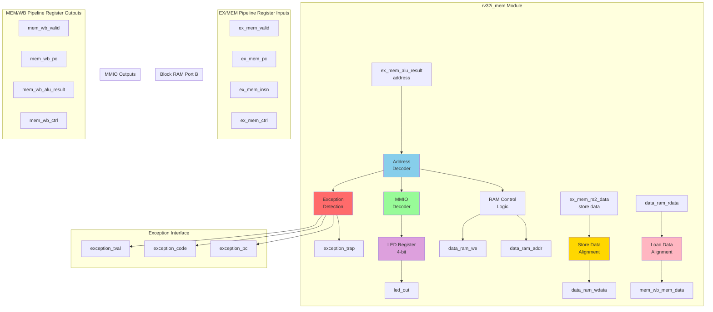

# RV32I Memory Access (MEM) Stage Specification

**Module Name:** `rv32i_mem`  
**File:** `rtl/cpu/rv32i_mem.sv`  
**Version:** 1.0  
**Date:** January 4, 2026  
**Assertion Module:** `sim/assertions/rv32i_mem_timing_spec.sv`

---

## Table of Contents

1. [Overview](#overview)
2. [Block Diagram](#block-diagram)
3. [Interface Signals](#interface-signals)
4. [Functional Description](#functional-description)
5. [Timing Diagrams](#timing-diagrams)
6. [Exception Conditions](#exception-conditions)
7. [Verification Points](#verification-points)
8. [References](#references)

---

## Overview

The Memory Access (MEM) stage is responsible for load/store operations, byte-level alignment, MMIO decoding, and exception detection. It controls Block RAM Port B when the CPU is running and handles memory-mapped I/O devices.

### Responsibilities

1. **Load Operations:** Read data from memory with byte/halfword/word granularity
2. **Store Operations:** Write data to memory with byte write enables
3. **Byte Alignment:** Extract and sign-extend loaded data based on address
4. **MMIO Decode:** Detect memory-mapped LED register at 0x407C
5. **Exception Detection:** Detect misaligned access, illegal addresses
6. **RAM Arbitration:** Control Port B access during normal execution

### Key Features

- **5 Load Types:** LB, LH, LW, LBU, LHU (byte/half/word, signed/unsigned)
- **3 Store Types:** SB, SH, SW (byte/half/word)
- **Byte Write Enables:** Fine-grained write control [3:0]
- **MMIO LED Register:** 4-bit output at address 0x407C
- **Misalignment Detection:** Flag unaligned loads/stores
- **Address Range Check:** Validate RAM/MMIO address ranges

---

## Block Diagram



---

## Interface Signals

### Input Signals

| Signal | Width | Source | Description |
|--------|-------|--------|-------------|
| `clk` | 1 | System | System clock |
| `rst_n` | 1 | System | Active-low reset |
| **EX/MEM Pipeline Register** ||||
| `ex_mem_valid` | 1 | rv32i_ex | Instruction valid |
| `ex_mem_pc` | 32 | rv32i_ex | Program Counter |
| `ex_mem_insn` | 32 | rv32i_ex | Instruction (for debug) |
| `ex_mem_alu_result` | 32 | rv32i_ex | Memory address |
| `ex_mem_rs2_data` | 32 | rv32i_ex | Store data |
| `ex_mem_ctrl` | struct | rv32i_ex | Control signals |
| **Block RAM Port B (when running)** ||||
| `data_ram_rdata` | 32 | Block RAM | Read data (32-bit word) |
| **CPU State** ||||
| `running` | 1 | Top | CPU running (not halted) |

### Output Signals

| Signal | Width | Destination | Description |
|--------|-------|-------------|-------------|
| **Block RAM Port B** ||||
| `data_ram_addr` | 11 | Block RAM | Word address [10:0] |
| `data_ram_wdata` | 32 | Block RAM | Write data |
| `data_ram_we` | 4 | Block RAM | Byte write enables [3:0] |
| **MMIO Outputs** ||||
| `led_out` | 4 | Top | LED register value |
| **Exception Interface** ||||
| `exception_trap` | 1 | rv32i_csr | Exception occurred |
| `exception_pc` | 32 | rv32i_csr | PC of faulting instruction |
| `exception_code` | 4 | rv32i_csr | Exception cause code |
| `exception_tval` | 32 | rv32i_csr | Exception value (address) |
| **MEM/WB Pipeline Register** ||||
| `mem_wb_valid` | 1 | rv32i_wb | Instruction valid |
| `mem_wb_pc` | 32 | rv32i_wb | Program Counter |
| `mem_wb_insn` | 32 | rv32i_wb | Instruction |
| `mem_wb_mem_data` | 32 | rv32i_wb | Load result (aligned) |
| `mem_wb_alu_result` | 32 | rv32i_wb | ALU result (pass-through) |
| `mem_wb_ctrl` | struct | rv32i_wb | Control signals |

---

## Functional Description

### 4.1 Address Decode

**Address Space Map:**

```
0x0000_0000 - 0x0000_1FFF : Block RAM (8KB, 2048 words)
0x0000_407C              : MMIO LED Register (4 bits)
0x0000_2000 - 0xFFFF_FFFF : Invalid (causes exception)
```

**Implementation:**

```systemverilog
logic [31:0] mem_addr;
logic        is_ram_access;
logic        is_mmio_led;
logic        is_invalid_addr;

assign mem_addr = ex_mem_alu_result;

// Address range decode
assign is_ram_access   = (mem_addr < 32'h0000_2000);  // 0-8KB
assign is_mmio_led     = (mem_addr == 32'h0000_407C);
assign is_invalid_addr = !is_ram_access && !is_mmio_led;
```

---

### 4.2 Load Data Alignment and Sign Extension

**Purpose:** Extract byte/halfword from 32-bit RAM word and sign-extend if needed.

```systemverilog
logic [31:0] load_data_aligned;
logic [1:0]  byte_offset;

assign byte_offset = mem_addr[1:0];  // Byte position within word

always_comb begin
    case (ex_mem_ctrl.mem_size)
        3'b000: begin // LB / LBU (byte)
            case (byte_offset)
                2'b00: load_data_aligned = {{24{~ex_mem_ctrl.mem_unsigned & data_ram_rdata[7]}},  data_ram_rdata[7:0]};
                2'b01: load_data_aligned = {{24{~ex_mem_ctrl.mem_unsigned & data_ram_rdata[15]}}, data_ram_rdata[15:8]};
                2'b10: load_data_aligned = {{24{~ex_mem_ctrl.mem_unsigned & data_ram_rdata[23]}}, data_ram_rdata[23:16]};
                2'b11: load_data_aligned = {{24{~ex_mem_ctrl.mem_unsigned & data_ram_rdata[31]}}, data_ram_rdata[31:24]};
            endcase
        end
        
        3'b001: begin // LH / LHU (halfword)
            case (byte_offset[1])
                1'b0: load_data_aligned = {{16{~ex_mem_ctrl.mem_unsigned & data_ram_rdata[15]}}, data_ram_rdata[15:0]};
                1'b1: load_data_aligned = {{16{~ex_mem_ctrl.mem_unsigned & data_ram_rdata[31]}}, data_ram_rdata[31:16]};
            endcase
        end
        
        3'b010: begin // LW (word)
            load_data_aligned = data_ram_rdata;
        end
        
        default: load_data_aligned = 32'h0;
    endcase
end
```

**Sign Extension Logic:**
- **LB/LH (signed):** MSB replicated to upper bits
- **LBU/LHU (unsigned):** Zero-extended
- **LW:** No extension (full 32-bit word)

---

### 4.3 Store Data Alignment and Write Enables

**Purpose:** Position store data in correct byte lanes and generate write enables.

```systemverilog
logic [31:0] store_data_aligned;
logic [3:0]  byte_write_enables;

always_comb begin
    store_data_aligned = 32'h0;
    byte_write_enables = 4'b0000;
    
    if (ex_mem_ctrl.mem_write) begin
        case (ex_mem_ctrl.mem_size)
            3'b000: begin // SB (byte)
                case (byte_offset)
                    2'b00: begin
                        store_data_aligned = {24'h0, ex_mem_rs2_data[7:0]};
                        byte_write_enables = 4'b0001;
                    end
                    2'b01: begin
                        store_data_aligned = {16'h0, ex_mem_rs2_data[7:0], 8'h0};
                        byte_write_enables = 4'b0010;
                    end
                    2'b10: begin
                        store_data_aligned = {8'h0, ex_mem_rs2_data[7:0], 16'h0};
                        byte_write_enables = 4'b0100;
                    end
                    2'b11: begin
                        store_data_aligned = {ex_mem_rs2_data[7:0], 24'h0};
                        byte_write_enables = 4'b1000;
                    end
                endcase
            end
            
            3'b001: begin // SH (halfword)
                case (byte_offset[1])
                    1'b0: begin
                        store_data_aligned = {16'h0, ex_mem_rs2_data[15:0]};
                        byte_write_enables = 4'b0011;
                    end
                    1'b1: begin
                        store_data_aligned = {ex_mem_rs2_data[15:0], 16'h0};
                        byte_write_enables = 4'b1100;
                    end
                endcase
            end
            
            3'b010: begin // SW (word)
                store_data_aligned = ex_mem_rs2_data;
                byte_write_enables = 4'b1111;
            end
        endcase
    end
end

// RAM outputs (only when not accessing MMIO)
assign data_ram_addr  = mem_addr[12:2];  // Word address
assign data_ram_wdata = store_data_aligned;
assign data_ram_we    = is_ram_access ? byte_write_enables : 4'b0000;
```

**Write Enable Examples:**

```
SB to 0x0000 (byte 0): we = 4'b0001, wdata = {24'h0, byte_data}
SB to 0x0001 (byte 1): we = 4'b0010, wdata = {16'h0, byte_data, 8'h0}
SB to 0x0002 (byte 2): we = 4'b0100, wdata = {8'h0, byte_data, 16'h0}
SB to 0x0003 (byte 3): we = 4'b1000, wdata = {byte_data, 24'h0}

SH to 0x0000 (half 0): we = 4'b0011, wdata = {16'h0, half_data}
SH to 0x0002 (half 1): we = 4'b1100, wdata = {half_data, 16'h0}

SW to 0x0000 (word):   we = 4'b1111, wdata = word_data
```

---

### 4.4 MMIO LED Register

**Address:** 0x0000_407C (byte address)  
**Width:** 4 bits  
**Access:** Write-only from CPU perspective

```systemverilog
logic [3:0] led_reg;

always_ff @(posedge clk or negedge rst_n) begin
    if (!rst_n) begin
        led_reg <= 4'h0;
    end else if (ex_mem_valid && ex_mem_ctrl.mem_write && is_mmio_led) begin
        // Store to LED address updates register
        led_reg <= ex_mem_rs2_data[3:0];
    end
end

assign led_out = led_reg;
```

**Usage Example:**
```assembly
LUI  x1, 0x0       # x1 = 0x0000_0000
ADDI x1, x1, 0x47C # x1 = 0x0000_047C (word-aligned base)
ADDI x2, x0, 0xF   # x2 = 0x0000_000F (LED pattern)
SW   x2, 0(x1)     # Store to 0x407C, LED = 0xF
```

---

### 4.5 Exception Detection

**Exception Types:**

| Exception Code | Cause | Detection Condition |
|----------------|-------|---------------------|
| 4'h0 | Instruction address misaligned | PC[1:0] != 2'b00 (detected in IF) |
| 4'h1 | Instruction access fault | N/A (RAM always accessible) |
| 4'h2 | Illegal instruction | Detected in ID stage |
| 4'h3 | Breakpoint | EBREAK detected |
| 4'h4 | Load address misaligned | Load address not aligned to size |
| 4'h5 | Load access fault | Load from invalid address |
| 4'h6 | Store address misaligned | Store address not aligned to size |
| 4'h7 | Store access fault | Store to invalid address |

**Implementation:**

```systemverilog
logic misaligned_load, misaligned_store;
logic load_fault, store_fault;

// Misalignment detection
always_comb begin
    case (ex_mem_ctrl.mem_size)
        3'b000: begin // Byte (always aligned)
            misaligned_load  = 1'b0;
            misaligned_store = 1'b0;
        end
        3'b001: begin // Halfword (must be 2-byte aligned)
            misaligned_load  = (mem_addr[0] != 1'b0) && ex_mem_ctrl.mem_read;
            misaligned_store = (mem_addr[0] != 1'b0) && ex_mem_ctrl.mem_write;
        end
        3'b010: begin // Word (must be 4-byte aligned)
            misaligned_load  = (mem_addr[1:0] != 2'b00) && ex_mem_ctrl.mem_read;
            misaligned_store = (mem_addr[1:0] != 2'b00) && ex_mem_ctrl.mem_write;
        end
        default: begin
            misaligned_load  = 1'b0;
            misaligned_store = 1'b0;
        end
    endcase
end

// Access fault detection
assign load_fault  = is_invalid_addr && ex_mem_ctrl.mem_read;
assign store_fault = is_invalid_addr && ex_mem_ctrl.mem_write;

// Exception aggregation
always_comb begin
    exception_trap = 1'b0;
    exception_code = 4'h0;
    exception_pc   = ex_mem_pc;
    exception_tval = mem_addr;
    
    if (ex_mem_valid) begin
        if (ex_mem_ctrl.is_ebreak) begin
            exception_trap = 1'b1;
            exception_code = 4'h3;  // Breakpoint
        end else if (ex_mem_ctrl.is_ecall) begin
            exception_trap = 1'b1;
            exception_code = 4'hB;  // Environment call (machine mode)
        end else if (misaligned_load) begin
            exception_trap = 1'b1;
            exception_code = 4'h4;
        end else if (load_fault) begin
            exception_trap = 1'b1;
            exception_code = 4'h5;
        end else if (misaligned_store) begin
            exception_trap = 1'b1;
            exception_code = 4'h6;
        end else if (store_fault) begin
            exception_trap = 1'b1;
            exception_code = 4'h7;
        end else if (ex_mem_ctrl.is_illegal) begin
            exception_trap = 1'b1;
            exception_code = 4'h2;  // Illegal instruction
        end
    end
end
```

---

### 4.6 MEM/WB Pipeline Register

```systemverilog
always_ff @(posedge clk or negedge rst_n) begin
    if (!rst_n) begin
        mem_wb_valid      <= 1'b0;
        mem_wb_pc         <= 32'h0;
        mem_wb_insn       <= 32'h0000_0013;
        mem_wb_mem_data   <= 32'h0;
        mem_wb_alu_result <= 32'h0;
        mem_wb_ctrl       <= '0;
    end else begin
        mem_wb_valid      <= ex_mem_valid;
        mem_wb_pc         <= ex_mem_pc;
        mem_wb_insn       <= ex_mem_insn;
        mem_wb_mem_data   <= load_data_aligned;
        mem_wb_alu_result <= ex_mem_alu_result;
        mem_wb_ctrl       <= ex_mem_ctrl;
    end
end
```

---

## Timing Diagrams

### 5.1 Normal Load (LW)

```
Clock    : ___/‾‾‾\___/‾‾‾\___/‾‾‾\___/‾‾‾\___
           
Cycle    :    N   | N+1   | N+2   | N+3
           
EX:      : LW    | ADD   | ...   | ...
MEM:     : NOP   | LW    | ADD   | ...
WB:      : ...   | NOP   | LW    | ADD
           
mem_addr : xxxxx | 0x0010| xxxxx | xxxxx
           :        | (address)
           
data_ram_: xxxxx | 0x004 | xxxxx | xxxxx
addr     :        | (word addr)
           
data_ram_: xxxxx | xxxxx | 0xABCD| xxxxx
rdata    :        |        | (1 cycle latency)
           
load_    : xxxxx | xxxxx | 0xABCD| xxxxx
data_    :        |        | (aligned)
aligned  :        |        |
           
mem_wb_  : xxxxx | xxxxx | 0xABCD| xxxxx
mem_data :        |        | (registered)
```

**Description:** Load data available 1 cycle after address presentation.

---

### 5.2 Store with Byte Write Enables (SB)

```
Clock    : ___/‾‾‾\___/‾‾‾\___/‾‾‾\___
           
Cycle    :    N   | N+1   | N+2
           
EX:      : SB    | ADD   | ...
MEM:     : NOP   | SB    | ADD
           :        | (byte 1)
           
mem_addr : xxxxx | 0x0101| xxxxx
           :        | (byte 1 of word)
           
data_ram_: xxxxx | 0x040 | xxxxx
addr     :        | (0x101>>2)
           
data_ram_: xxxxx | {16'h0,0xAB,8'h0}| xxxxx
wdata    :        | (aligned to byte 1)
           
data_ram_: 0000  | 0010  | 0000
we       :        | (byte 1 enable)
```

**Description:** Store byte positioned in correct lane with targeted write enable.

---

### 5.3 MMIO LED Write

```
Clock    : ___/‾‾‾\___/‾‾‾\___/‾‾‾\___
           
Cycle    :    N   | N+1   | N+2
           
EX:      : SW    | ADD   | ...
MEM:     : NOP   | SW    | ADD
           :        | (LED addr)
           
mem_addr : xxxxx | 0x407C| xxxxx
           :        | (MMIO LED)
           
is_mmio_ : 0     | 1     | 0
led      :        | (detect)
           
data_ram_: 0000  | 0000  | 0000
we       :        | (no RAM write)
           
led_reg  : 0x5   | 0x5   | 0xA
           :        |        | (updated)
           
led_out  : 0x5   | 0x5   | 0xA
           :        |        | (visible)
```

**Description:** MMIO write updates LED register without RAM access.

---

### 5.4 Load Misalignment Exception

```
Clock    : ___/‾‾‾\___/‾‾‾\___/‾‾‾\___/‾‾‾\___
           
Cycle    :    N   | N+1   | N+2   | N+3
           
EX:      : LW    | ADD   | ...   | ...
MEM:     : NOP   | LW    | BUBBLE| ...
           :        | (misalign)
           
mem_addr : xxxxx | 0x0101| xxxxx | xxxxx
           :        | (not 4-byte aligned)
           
misalign_: 0     | 1     | 0     | 0
load     :        | (detect)
           
exception: 0     | 1     | 0     | 0
_trap    :        | (assert)
           
exception: xxxxx | 0x4   | xxxxx | xxxxx
_code    :        | (load misaligned)
           
exception: xxxxx | 0x0101| xxxxx | xxxxx
_tval    :        | (bad address)
```

**Description:** Misaligned load triggers exception with address in tval.

---

## Exception Conditions

### 6.1 Load Address Misaligned (0x4)

**Trigger:**
- LH from odd address (addr[0] != 0)
- LW from non-4-byte-aligned address (addr[1:0] != 2'b00)

**Example:**
```assembly
LW x1, 1(x2)  # If x2=0x100, loads from 0x101 (misaligned)
```

---

### 6.2 Store Address Misaligned (0x6)

**Trigger:**
- SH to odd address
- SW to non-4-byte-aligned address

**Example:**
```assembly
SW x1, 2(x2)  # If x2=0x101, stores to 0x103 (misaligned)
```

---

### 6.3 Load/Store Access Fault (0x5/0x7)

**Trigger:** Access to address outside valid range (>= 0x2000 and not MMIO)

**Example:**
```assembly
LW x1, 0(x0)         # Valid (0x0000)
LW x1, 0x2000(x0)    # Fault (beyond RAM)
```

---

## Verification Points

### 7.1 Assertion Checklist

The following properties are verified by `rv32i_mem_timing_spec.sv`:

#### **SPEC-MEM-1: Load Byte Sign Extension**
```systemverilog
property lb_sign_extend;
    logic [7:0] byte_data;
    @(posedge clk) disable iff (!rst_n)
    (ex_mem_valid && ex_mem_ctrl.mem_read && 
     ex_mem_ctrl.mem_size == 3'b000 && !ex_mem_ctrl.mem_unsigned,
     byte_data = data_ram_rdata[7:0])  // Byte 0 example
    ##1 (mem_wb_mem_data == {{24{byte_data[7]}}, byte_data});
endproperty
```

#### **SPEC-MEM-2: Store Byte Write Enable**
```systemverilog
property sb_byte0_we;
    @(posedge clk) disable iff (!rst_n)
    (ex_mem_valid && ex_mem_ctrl.mem_write && 
     ex_mem_ctrl.mem_size == 3'b000 && mem_addr[1:0] == 2'b00)
    |-> (data_ram_we == 4'b0001);
endproperty
```

#### **SPEC-MEM-3: MMIO LED Update**
```systemverilog
property mmio_led_write;
    logic [3:0] led_value;
    @(posedge clk) disable iff (!rst_n)
    (ex_mem_valid && ex_mem_ctrl.mem_write && 
     mem_addr == 32'h0000_407C, led_value = ex_mem_rs2_data[3:0])
    |=> (led_out == led_value);
endproperty
```

#### **SPEC-MEM-4: Load Misalignment Detection**
```systemverilog
property lw_misalign_exception;
    @(posedge clk) disable iff (!rst_n)
    (ex_mem_valid && ex_mem_ctrl.mem_read && 
     ex_mem_ctrl.mem_size == 3'b010 && mem_addr[1:0] != 2'b00)
    |-> (exception_trap && exception_code == 4'h4);
endproperty
```

#### **SPEC-MEM-5: RAM Write Enable Zero for MMIO**
```systemverilog
property mmio_no_ram_write;
    @(posedge clk) disable iff (!rst_n)
    (ex_mem_valid && ex_mem_ctrl.mem_write && is_mmio_led)
    |-> (data_ram_we == 4'b0000);
endproperty
```

#### **SPEC-MEM-6: Load Access Fault**
```systemverilog
property load_access_fault;
    @(posedge clk) disable iff (!rst_n)
    (ex_mem_valid && ex_mem_ctrl.mem_read && mem_addr >= 32'h0000_2000)
    |-> (exception_trap && exception_code == 4'h5);
endproperty
```

---

### 7.2 Coverage Goals

1. **Load Coverage:** LB, LH, LW, LBU, LHU from all byte offsets
2. **Store Coverage:** SB, SH, SW to all byte offsets
3. **MMIO Coverage:** LED write with all 16 patterns (0x0-0xF)
4. **Exception Coverage:**
   - Load misalignment (halfword odd, word unaligned)
   - Store misalignment (halfword odd, word unaligned)
   - Access faults (load/store beyond RAM)
5. **Edge Cases:**
   - Load from 0x1FFC (last RAM word)
   - Store to 0x1FFC
   - Consecutive MMIO writes

---

## References

### Related Documents
- **[rv32i_modular_architecture_spec.md](../../docs/rv32i_modular_architecture_spec.md)** - Overall architecture
- **[rv32i_pipeline_interfaces.md](../../docs/rv32i_pipeline_interfaces.md)** - Pipeline register structures
- **[rv32i_ex_spec.md](rv32i_ex_spec.md)** - EX stage (provides address)
- **[rv32i_wb_spec.md](rv32i_wb_spec.md)** - WB stage (receives load data)
- **[rv32i_csr_spec.md](rv32i_csr_spec.md)** - CSR module (exception handling)

### Assertion Modules
- **[rv32i_mem_timing_spec.sv](../../sim/assertions/rv32i_mem_timing_spec.sv)** - MEM stage timing assertions
- **[rv32i_mmio_led_spec.sv](../../sim/assertions/rv32i_mmio_led_spec.sv)** - Existing MMIO assertions
- **[bind_rv32i_mem_spec.sv](../../sim/assertions/bind_rv32i_mem_spec.sv)** - Assertion binding file

### Test Cases
- **rv32i_basic_test.sv** - Load/store operations
- **rv32i_load_misalign_test.sv** - Load misalignment
- **rv32i_store_misalign_test.sv** - Store misalignment
- **load_store_exhaustive_test.sv** - All byte offsets (TBD)

---

**Specification Version:** 1.0  
**Last Updated:** 2026-01-04  
**Status:** Design Phase - Pre-Implementation
