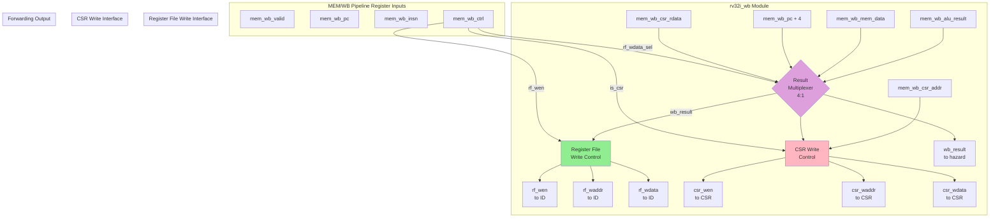

# RV32I Write Back (WB) Stage Specification

**Module Name:** `rv32i_wb`  
**File:** `rtl/cpu/rv32i_wb.sv`  
**Version:** 1.0  
**Date:** January 4, 2026  
**Assertion Module:** `sim/assertions/rv32i_wb_timing_spec.sv`

---

## Table of Contents

1. [Overview](#overview)
2. [Block Diagram](#block-diagram)
3. [Interface Signals](#interface-signals)
4. [Functional Description](#functional-description)
5. [Timing Diagrams](#timing-diagrams)
6. [Verification Points](#verification-points)
7. [References](#references)

---

## Overview

The Write Back (WB) stage is responsible for selecting the final result to write to the register file or CSR, committing instruction results, and providing forwarding data to earlier pipeline stages. It represents the final stage of the 5-stage RV32I pipeline.

### Responsibilities

1. **Result Multiplexing:** Select between ALU result, memory data, PC+4, or CSR data
2. **Register File Write:** Commit instruction result to destination register
3. **CSR Write:** Update Control and Status Registers
4. **Forwarding Source:** Provide committed data for WB→EX forwarding path
5. **Instruction Retirement:** Mark instruction as architecturally committed

### Key Features

- **4-Way Result Multiplexer:** ALU / Memory / PC+4 / CSR selection
- **Conditional Register Write:** x0 writes suppressed, conditional on `rf_wen`
- **CSR Write Interface:** Support CSRRW/CSRRS/CSRRC operations
- **Zero-Cycle Forwarding:** Result immediately available for bypass

---

## Block Diagram



---

## Interface Signals

### Input Signals

| Signal | Width | Source | Description |
|--------|-------|--------|-------------|
| `clk` | 1 | System | System clock (unused, WB is combinational) |
| `rst_n` | 1 | System | Active-low reset (unused) |
| **MEM/WB Pipeline Register** ||||
| `mem_wb_valid` | 1 | rv32i_mem | Instruction valid |
| `mem_wb_pc` | 32 | rv32i_mem | Program Counter |
| `mem_wb_insn` | 32 | rv32i_mem | Instruction (for debug) |
| `mem_wb_mem_data` | 32 | rv32i_mem | Load result (aligned) |
| `mem_wb_alu_result` | 32 | rv32i_mem | ALU computation result |
| `mem_wb_csr_rdata` | 32 | rv32i_mem | CSR read value |
| `mem_wb_ctrl` | struct | rv32i_mem | Control signals |

### Output Signals

| Signal | Width | Destination | Description |
|--------|-------|-------------|-------------|
| **Register File Write Interface** ||||
| `rf_wen` | 1 | rv32i_id | Register file write enable |
| `rf_waddr` | 5 | rv32i_id | Write address (rd) |
| `rf_wdata` | 32 | rv32i_id | Write data (final result) |
| **CSR Write Interface** ||||
| `csr_wen` | 1 | rv32i_csr | CSR write enable |
| `csr_waddr` | 12 | rv32i_csr | CSR address |
| `csr_wdata` | 32 | rv32i_csr | CSR write data |
| **Forwarding Output** ||||
| `wb_result` | 32 | rv32i_hazard | Final result for WB→EX forwarding |

---

## Functional Description

### 4.1 Result Multiplexer

**Purpose:** Select final writeback value based on instruction type.

```systemverilog
logic [31:0] wb_result;

always_comb begin
    case (mem_wb_ctrl.rf_wdata_sel)
        2'b00:   wb_result = mem_wb_alu_result;  // ALU result (R-type, I-type, AUIPC, LUI)
        2'b01:   wb_result = mem_wb_mem_data;    // Load result (LB, LH, LW, LBU, LHU)
        2'b10:   wb_result = mem_wb_pc + 4;      // PC+4 (JAL, JALR)
        2'b11:   wb_result = mem_wb_csr_rdata;   // CSR read value (CSRRW, CSRRS, CSRRC)
        default: wb_result = 32'h0;
    endcase
end
```

**Instruction-to-Source Mapping:**

| Instruction Type | rf_wdata_sel | Source |
|------------------|--------------|--------|
| ADD, SUB, AND, OR, XOR, SLL, SRL, SRA, SLT, SLTU | 2'b00 | ALU result |
| ADDI, ANDI, ORI, XORI, SLLI, SRLI, SRAI, SLTI, SLTIU | 2'b00 | ALU result |
| LUI | 2'b00 | ALU passes immediate |
| AUIPC | 2'b00 | ALU (PC + imm) |
| LB, LH, LW, LBU, LHU | 2'b01 | Memory load data |
| JAL, JALR | 2'b10 | PC+4 (return address) |
| CSRRW, CSRRS, CSRRC | 2'b11 | CSR read value |

---

### 4.2 Register File Write Control

**Purpose:** Generate register file write signals with x0 suppression.

```systemverilog
// Extract destination register address
logic [4:0] rd_addr;
assign rd_addr = mem_wb_insn[11:7];

// Register file write signals
assign rf_wen   = mem_wb_valid && mem_wb_ctrl.rf_wen && (rd_addr != 5'b0);
assign rf_waddr = rd_addr;
assign rf_wdata = wb_result;
```

**Key Rules:**
1. **Valid instruction:** Only valid instructions commit
2. **Write enable:** Control signal from decode stage
3. **x0 protection:** Writes to x0 suppressed (RISC-V compliance)

**Example Suppressed Write:**
```assembly
ADDI x0, x1, 1  # rd=x0, result discarded (no RF write)
```

---

### 4.3 CSR Write Control

**Purpose:** Generate CSR write signals for CSRRW/CSRRS/CSRRC instructions.

```systemverilog
logic [11:0] csr_addr;
assign csr_addr = mem_wb_insn[31:20];  // CSR address from immediate field

// CSR write signals
assign csr_wen   = mem_wb_valid && mem_wb_ctrl.is_csr && mem_wb_ctrl.csr_op[1];
assign csr_waddr = csr_addr;
assign csr_wdata = wb_result;  // Write-back value (rs1 or immediate)
```

**CSR Operations:**

| Instruction | csr_op | Behavior |
|-------------|--------|----------|
| CSRRW | 2'b10 | CSR = rs1 (write) |
| CSRRS | 2'b10 | CSR = CSR \| rs1 (set bits) |
| CSRRC | 2'b10 | CSR = CSR & ~rs1 (clear bits) |

**Note:** CSR operation type determined in CSR module, WB only provides data.

---

### 4.4 Forwarding Output

```systemverilog
// Forwarding output to hazard unit (for WB→EX forwarding)
assign wb_result = wb_result;  // Direct assignment (combinational)
```

**Usage:** Hazard unit forwards `wb_result` to EX stage when data hazard detected.

---

## Timing Diagrams

### 5.1 Normal Register Write (ADD)

```
Clock    : ___/‾‾‾\___/‾‾‾\___/‾‾‾\___/‾‾‾\___/‾‾‾\___
           
Cycle    :    0   |   1   |   2   |   3   |   4
           
IF:      : ADD   | SUB   | OR    | ...   | ...
ID:      : NOP   | ADD   | SUB   | OR    | ...
EX:      : ...   | NOP   | ADD   | SUB   | OR
MEM:     : ...   | ...   | NOP   | ADD   | SUB
WB:      : ...   | ...   | ...   | NOP   | ADD
           :        |        |        |        | (commit)
           
mem_wb_  : ...   | ...   | ...   | ...   | ADD
insn     :        |        |        |        | x3,x1,x2
           
mem_wb_  : ...   | ...   | ...   | ...   | 0x0030
alu_     :        |        |        |        | (result)
result   :        |        |        |        |
           
rf_wdata_: ...   | ...   | ...   | ...   | 00
sel      :        |        |        |        | (ALU)
           
wb_result: ...   | ...   | ...   | ...   | 0x0030
           :        |        |        |        | (selected)
           
rf_wen   : 0     | 0     | 0     | 0     | 1
           :        |        |        |        | (commit)
           
rf_waddr : x     | x     | x     | x     | 3
rf_wdata : x     | x     | x     | x     | 0x0030
```

**Description:** ADD result committed to register file in WB stage.

---

### 5.2 Load Instruction Write-back (LW)

```
Clock    : ___/‾‾‾\___/‾‾‾\___/‾‾‾\___/‾‾‾\___/‾‾‾\___
           
Cycle    :    0   |   1   |   2   |   3   |   4
           
IF:      : LW    | ADD   | ...   | ...   | ...
ID:      : NOP   | LW    | ADD   | ...   | ...
EX:      : ...   | NOP   | LW    | ADD   | ...
MEM:     : ...   | ...   | NOP   | LW    | ADD
WB:      : ...   | ...   | ...   | NOP   | LW
           :        |        |        |        | (commit)
           
mem_wb_  : ...   | ...   | ...   | ...   | LW
insn     :        |        |        |        | x1,0(x2)
           
mem_wb_  : ...   | ...   | ...   | ...   | 0xABCD
mem_data :        |        |        |        | (from RAM)
           
rf_wdata_: ...   | ...   | ...   | ...   | 01
sel      :        |        |        |        | (MEM)
           
wb_result: ...   | ...   | ...   | ...   | 0xABCD
           :        |        |        |        | (selected)
           
rf_wen   : 0     | 0     | 0     | 0     | 1
rf_waddr : x     | x     | x     | x     | 1
rf_wdata : x     | x     | x     | x     | 0xABCD
```

**Description:** Load data committed to register file in WB stage.

---

### 5.3 JAL Return Address Write

```
Clock    : ___/‾‾‾\___/‾‾‾\___/‾‾‾\___/‾‾‾\___/‾‾‾\___
           
Cycle    :    0   |   1   |   2   |   3   |   4
           
IF:      : JAL   | BUBBLE| BUBBLE| TGT   | ...
ID:      : NOP   | JAL   | BUBBLE| BUBBLE| TGT
EX:      : ...   | NOP   | JAL   | BUBBLE| BUBBLE
MEM:     : ...   | ...   | NOP   | JAL   | BUBBLE
WB:      : ...   | ...   | ...   | NOP   | JAL
           :        |        |        |        | (commit)
           
mem_wb_pc: ...   | ...   | ...   | ...   | 0x0100
           :        |        |        |        | (JAL PC)
           
pc_plus_4: ...   | ...   | ...   | ...   | 0x0104
           :        |        |        |        | (return addr)
           
rf_wdata_: ...   | ...   | ...   | ...   | 10
sel      :        |        |        |        | (PC+4)
           
wb_result: ...   | ...   | ...   | ...   | 0x0104
           
rf_wen   : 0     | 0     | 0     | 0     | 1
rf_waddr : x     | x     | x     | x     | 1 (ra)
rf_wdata : x     | x     | x     | x     | 0x0104
```

**Description:** JAL saves return address (PC+4) to link register.

---

### 5.4 CSR Write (CSRRW)

```
Clock    : ___/‾‾‾\___/‾‾‾\___/‾‾‾\___/‾‾‾\___/‾‾‾\___
           
Cycle    :    0   |   1   |   2   |   3   |   4
           
WB:      : ...   | ...   | ...   | NOP   | CSRRW
           :        |        |        |        | x1,mtvec,x2
           
mem_wb_  : ...   | ...   | ...   | ...   | 0x1000
csr_     :        |        |        |        | (old mtvec)
rdata    :        |        |        |        |
           
mem_wb_  : ...   | ...   | ...   | ...   | 0x2000
alu_     :        |        |        |        | (rs1=x2 value)
result   :        |        |        |        |
           
wb_result: ...   | ...   | ...   | ...   | 0x1000
           :        |        |        |        | (CSR old value to x1)
           
rf_wen   : 0     | 0     | 0     | 0     | 1
rf_wdata : x     | x     | x     | x     | 0x1000
           
csr_wen  : 0     | 0     | 0     | 0     | 1
csr_waddr: x     | x     | x     | x     | 0x305 (mtvec)
csr_wdata: x     | x     | x     | x     | 0x2000
```

**Description:** CSRRW writes new value to CSR, reads old value to rd.

---

### 5.5 Write to x0 (Suppressed)

```
Clock    : ___/‾‾‾\___/‾‾‾\___/‾‾‾\___/‾‾‾\___/‾‾‾\___
           
Cycle    :    0   |   1   |   2   |   3   |   4
           
WB:      : ...   | ...   | ...   | NOP   | ADDI
           :        |        |        |        | x0,x1,1
           
rd_addr  : x     | x     | x     | x     | 0
           :        |        |        |        | (x0 detected)
           
mem_wb_  : ...   | ...   | ...   | ...   | 1
ctrl.    :        |        |        |        | (decode says write)
rf_wen   :        |        |        |        |
           
wb_result: ...   | ...   | ...   | ...   | 0x1234
           :        |        |        |        | (computed)
           
rf_wen   : 0     | 0     | 0     | 0     | 0
           :        |        |        |        | (SUPPRESSED)
           
rf_waddr : x     | x     | x     | x     | 0
rf_wdata : x     | x     | x     | x     | 0x1234
           :        |        |        |        | (no effect)
```

**Description:** Write to x0 suppressed by WB stage logic.

---

## Verification Points

### 6.1 Assertion Checklist

The following properties are verified by `rv32i_wb_timing_spec.sv`:

#### **SPEC-WB-1: Result Mux Selection (ALU)**
```systemverilog
property result_mux_alu;
    @(posedge clk) disable iff (!rst_n)
    (mem_wb_valid && mem_wb_ctrl.rf_wdata_sel == 2'b00)
    |-> (wb_result == mem_wb_alu_result);
endproperty
```

#### **SPEC-WB-2: Result Mux Selection (Memory)**
```systemverilog
property result_mux_mem;
    @(posedge clk) disable iff (!rst_n)
    (mem_wb_valid && mem_wb_ctrl.rf_wdata_sel == 2'b01)
    |-> (wb_result == mem_wb_mem_data);
endproperty
```

#### **SPEC-WB-3: x0 Write Suppression**
```systemverilog
property x0_write_suppressed;
    @(posedge clk) disable iff (!rst_n)
    (mem_wb_valid && mem_wb_ctrl.rf_wen && rd_addr == 5'b0)
    |-> (rf_wen == 1'b0);
endproperty
```

#### **SPEC-WB-4: Register Write Visibility**
```systemverilog
property rf_write_committed;
    logic [4:0] addr;
    logic [31:0] data;
    @(posedge clk) disable iff (!rst_n)
    (rf_wen && rf_waddr != 5'b0, addr = rf_waddr, data = rf_wdata)
    |=> (rf_read(addr) == data);  // Helper function to read RF
endproperty
```

#### **SPEC-WB-5: CSR Write Enable**
```systemverilog
property csr_write_enabled;
    @(posedge clk) disable iff (!rst_n)
    (mem_wb_valid && mem_wb_ctrl.is_csr)
    |-> (csr_wen == 1'b1);
endproperty
```

#### **SPEC-WB-6: Forwarding Data Matches RF Write**
```systemverilog
property wb_forward_matches_rf;
    @(posedge clk) disable iff (!rst_n)
    (rf_wen) |-> (wb_result == rf_wdata);
endproperty
```

---

### 6.2 Coverage Goals

1. **Result Mux Coverage:** All 4 sources selected
2. **Register Write Coverage:**
   - Writes to all 32 registers (x0 suppressed)
   - Write enable asserted/deasserted
3. **CSR Write Coverage:** All supported CSR addresses written
4. **Edge Cases:**
   - Valid=0 (no write)
   - rd=x0 suppression
   - CSR and RF write simultaneously

---

## References

### Related Documents
- **[rv32i_modular_architecture_spec.md](../../docs/rv32i_modular_architecture_spec.md)** - Overall architecture
- **[rv32i_pipeline_interfaces.md](../../docs/rv32i_pipeline_interfaces.md)** - Pipeline register structures
- **[rv32i_mem_spec.md](rv32i_mem_spec.md)** - MEM stage (provides load data)
- **[rv32i_id_spec.md](rv32i_id_spec.md)** - ID stage (receives RF writes)
- **[rv32i_hazard_spec.md](rv32i_hazard_spec.md)** - Hazard unit (uses wb_result for forwarding)

### Assertion Modules
- **[rv32i_wb_timing_spec.sv](../../sim/assertions/rv32i_wb_timing_spec.sv)** - WB stage timing assertions
- **[bind_rv32i_wb_spec.sv](../../sim/assertions/bind_rv32i_wb_spec.sv)** - Assertion binding file

### Test Cases
- **rv32i_basic_test.sv** - All instruction types reaching WB
- **register_write_test.sv** - RF write verification (TBD)
- **x0_suppression_test.sv** - x0 write suppression (TBD)

---

**Specification Version:** 1.0  
**Last Updated:** 2026-01-04  
**Status:** Design Phase - Pre-Implementation
